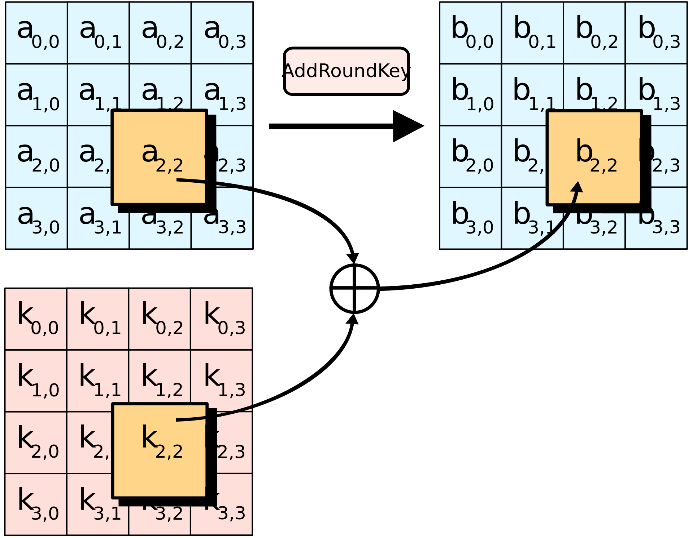
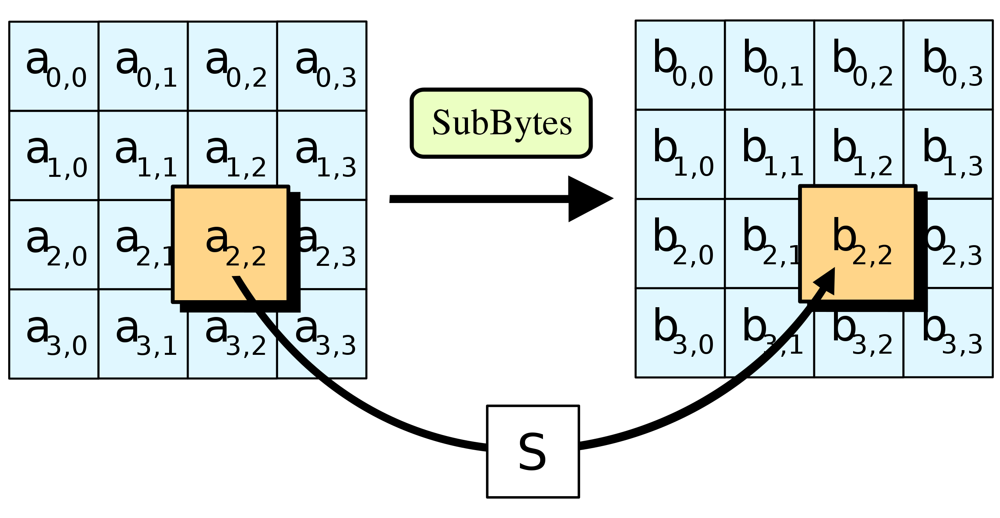
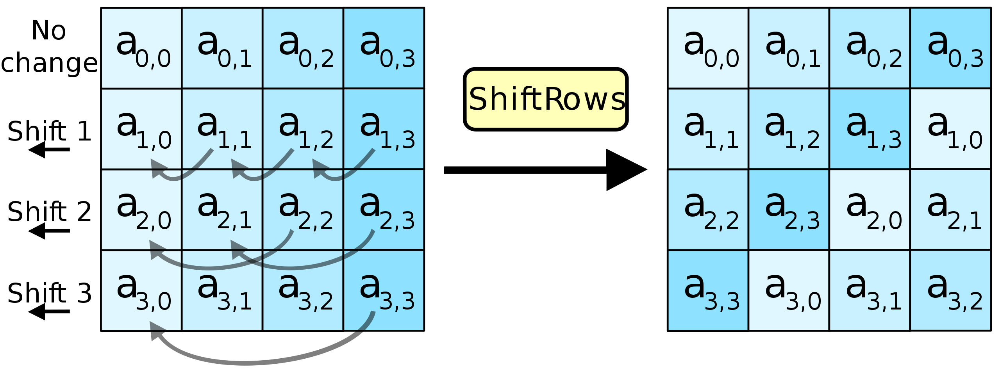
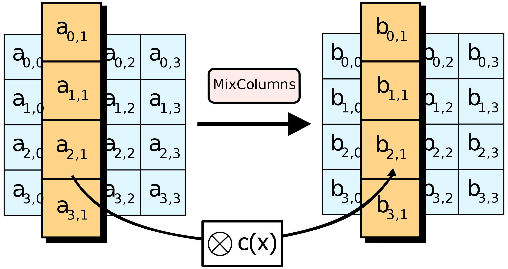

# Advanced Ecryption Standard
# Table of Contents

- [Advanced Ecryption Standard](#advanced-ecryption-standard)
- [Table of Contents](#table-of-contents)
  - [AES-128: From Theory to Full Implementation and Testing](#aes-128-from-theory-to-full-implementation-and-testing)
    - [Objective](#objective)
    - [What We'll Implement](#what-well-implement)
    - [Final Testing \& Validation](#final-testing--validation)
  - [Structure of AES128](#structure-of-aes128)
    - [Helper Functions for AES State Representation](#helper-functions-for-aes-state-representation)
      - [bytes\_to\_matrix(text)](#bytes_to_matrixtext)
      - [matrix\_to\_bytes(matrix)](#matrix_to_bytesmatrix)
    - [Algorithm workflow](#algorithm-workflow)
  - [Round keys](#round-keys)
  - [Confusion through Substitution](#confusion-through-substitution)
  - [AES S-Box: Construction Overview](#aes-s-box-construction-overview)
    - [Step-by-Step Construction](#step-by-step-construction)
  - [Diffusion through permutation](#diffusion-through-permutation)
  - [MixColumns](#mixcolumns)
  - [Key expansion](#key-expansion)
  - [The AES128 full naive implementation](#the-aes128-full-naive-implementation)
- [Conclusion](#conclusion)


## AES-128: From Theory to Full Implementation and Testing

This project walks through the complete implementation of the **AES-128** symmetric block cipher, from the ground up. We start by explaining and implementing each of the core components of the AES algorithm according to the official Rijndael specification, and then we combine them into a fully working encryption and decryption engine. Finally, we test our implementation against the well-established PyCryptodome library to ensure correctness.

### Objective

- Understand the inner workings of AES-128 (Advanced Encryption Standard).
- Implement each transformation step manually in Python.
- Assemble the transformations into a full encryption and decryption pipeline.
- Validate the correctness of the implementation using known ciphertexts and reference outputs from PyCryptodome (in ECB mode).

---

### What We'll Implement

AES operates on 16-byte blocks and consists of multiple rounds of transformation. The major steps we will implement are:

1. **Key Expansion (Key Schedule)**  
   Expands a 16-byte key into multiple round keys using byte substitution, rotation, and round constants.

2. **Initial Round**  
   - AddRoundKey: XOR the plaintext with the first round key

3. **Main Rounds (9 rounds for AES-128)**  
   Each round consists of:
   - SubBytes: Apply a non-linear S-box substitution to each byte  
   - ShiftRows: Rotate each row of the state matrix  
   - MixColumns: Mix the bytes of each column using a fixed matrix multiplication in GF(2⁸)  
   - AddRoundKey: XOR the state with the current round key

4. **Final Round (10th round)**  
   Like the main rounds, but **without** the MixColumns step

5. **Inverse Operations for Decryption**  
   We also implement the inverse transformations: InvSubBytes, InvShiftRows, InvMixColumns, and the reversed key schedule application to support decryption.

---

### Final Testing & Validation

Once the full encryption and decryption logic is in place, we test the implementation using:

- A custom plaintext and key
- The PyCryptodome AES implementation in ECB mode

Although we do not explicitly use ECB mode in our custom code, we only process a **single 16-byte block at a time**, with **no chaining or padding**, which makes our implementation functionally equivalent to ECB.

We ensure that:
- The ciphertext from our implementation matches PyCryptodome's
- The decrypted result matches the original plaintext
- All AES transformations behave as specified

By the end of this walkthrough, we will have a fully working AES-128 encryption/decryption engine that is **byte-accurate and behaviorally equivalent** to a standard cryptographic library — but built entirely from scratch for educational clarity and full control.

---
## Structure of AES128


Let $m \in \{0, 1\}^{128}$ be a message encrypted to $c \in \{0, 1\}^{128}$ by some encryption function $E$ that takes a key $k \in \{0, 1\}^{128}$
- $m$ has 16 bytes
- AES works with a 4x4 column major *state*

Let's define some helper functions

```python
def bytes_to_matrix(text):
    """Converts a 16-byte array into a 4x4 matrix."""
    return [list(text[i : i + 4]) for i in range(0, len(text), 4)]


def matrix_to_bytes(matrix):
    """Converts a 4x4 matrix into a 16-byte array."""
    return bytes(sum(matrix, []))

M = bytes_to_matrix(b"Some 16byte text")
print(M)
print(matrix_to_bytes(M))
```
### Helper Functions for AES State Representation

In AES, a 16-byte block is internally represented as a **4x4 matrix** (called the **state**) in column-major order. These helper functions convert between a flat byte array and the matrix representation.

---

#### bytes_to_matrix(text)

```python
def bytes_to_matrix(text):
    """Converts a 16-byte array into a 4x4 matrix."""
    return [list(text[i : i + 4]) for i in range(0, len(text), 4)]
```
Converts a 16-byte input into a 4×4 matrix (list of 4 lists, each with 4 bytes).
AES performs its operations (like SubBytes, ShiftRows, and MixColumns) on this matrix form. Example: bytes_to_matrix(b"Some 16byte text")

And we have the following output:
```[83, 111, 109, 101],   # 'Some'
  [32, 49, 54, 98],      # ' 16b'
  [121, 116, 101, 32],   # 'yte '
  [116, 101, 120, 116]   # 'text'
```
Now 
#### matrix_to_bytes(matrix)
```
def matrix_to_bytes(matrix):
    """Converts a 4x4 matrix into a 16-byte array."""
    return bytes(sum(matrix, []))
```
Flattens a 4×4 matrix back into a single 16-byte array.
```
matrix_to_bytes([
  [83, 111, 109, 101],
  [32, 49, 54, 98],
  [121, 116, 101, 32],
  [116, 101, 120, 116]
])
```
And provides the following output: `b'Some 16byte text'`

These functions help us switch between byte-level input and AES's matrix-based internal representation, enabling a clearer implementation of the AES algorithm.


### Algorithm workflow

**1. KeyExpansion**  
- round keys are derived from the cipher key using the **AES key schedule**. AES requires a separate 128-bit round key block for each round plus one more.

**2.Initial round key addition:**  
- AddRoundKey – each byte of the state is combined with a byte of the round key using bitwise xor.

**3.Then we have 9, 11 or 13 rounds:**
- SubBytes – a **non-linear substitution step** where each byte is replaced with another according to a lookup table.
- ShiftRows – a transposition step where the last three rows of the state are shifted cyclically a certain number of steps.
- MixColumns – a **linear mixing operation** which operates on the columns of the state, combining the four bytes in each column.
- AddRoundKey

**4. Final round**(making 10, 12 or 14 rounds in total):
- SubBytes
- ShiftRows
- AddRoundKey


## Round keys

The initial key addition phase, which is next, has a single AddRoundKey step. The AddRoundKey step is straightforward: it XORs the current state with the current round key.


AddRoundKey also occurs as the final step of each round. AddRoundKey is what makes AES a **keyed permutation** rather than just a permutation. It's the only part of AES where the key is mixed into the state, but it is crucial for determining the permutation that occurs.

```python
def add_round_key(s, k):
    return [[sss ^ kkk for sss, kkk in zip(ss, kk)] for ss, kk in zip(s, k)]
```

## Confusion through Substitution

The first step of each AES round is SubBytes.  

Let
- $S:\{0,1\}^8 \longrightarrow \{0,1\}^8$ be a fixed permutation (a one-to-one function).  
    - This permutation  is  applied  to  each  of  the  16  cells,  one  cell  at  a  time
    - Specified in AES standard -> Hard coded

*Intuition*: 
- This involves taking each byte of the state matrix and substituting it for a different byte in a preset $16x16$ lookup table
- The lookup table is called a **Substitution box** or **S-box** for short

**Design**
- No fixed points -- $S(x) \neq x \ \forall  x \in \{0, 1\}^8$
- No inverse points -- $S(x) \neq \bar{x}$  where  $\bar{x}$ is the complement of bits (bit flipped $x$)



**Motivation**
- **Confusion** = Given just a ciphertext, there should be no way to learn anything about the key. => Complex relationship between ciphertext and key
- The main purpose of the S-box is to transform the input in a way that is resistant to being approximated by linear functions => **high non-linearity**

**How is the S-box computed**

## AES S-Box: Construction Overview

The AES S-box is designed to provide **non-linearity** and **confusion** in the cipher. Each byte in the AES state is substituted using this S-box, and its construction involves two key transformations:

1. **Multiplicative Inverse in GF(2⁸)**
2. **Affine Transformation**

---

### Step-by-Step Construction

- **Input Byte $ A_i \in GF(2^8) $**

Let each input byte be interpreted as an element of the finite field \( GF(2^8) \).  
This field uses the **irreducible polynomial**:

\[
m(x) = x^8 + x^4 + x^3 + x + 1
\]

**Example:**
If the input byte is:

\[
A_i = 11000010 \Rightarrow A_i(x) = x^7 + x^6 + x
\]

---

- **Compute the Multiplicative Inverse**

We compute the multiplicative inverse of \( A_i \) in \( GF(2^8) \). That is:

\[
B_i' = A_i^{-1} \in GF(2^8)
\]

**Example:**
\[
B_i' = x^5 + x^3 + x^2 + x + 1 \Rightarrow B_i' = 00101111
\]

This inverse satisfies:

\[
A_i(x) \cdot B_i'(x) \equiv 1 \pmod{m(x)}
\]

Note: If \( A_i = 0 \), which has no inverse, the inverse is defined as 0.

---

- **Apply the Affine Transformation**

To destroy the algebraic structure of the inversion and increase resistance to certain attacks, we apply an **affine transformation** over \( GF(2) \). This is a linear transformation followed by the addition of a constant:

\[
B_i = M \cdot B_i' + C
\]

Where:
- \( M \) is a fixed **8×8 binary matrix**
- \( C \) is a fixed **8-bit constant vector**
- All operations are over \( GF(2) \) (i.e., XOR and AND)

This step ensures further non-linearity and diffusion in the S-box.

---

The full transformation of a byte \( A_i \) into its S-box output \( B_i \) is:

$A_i \xrightarrow{\text{Inverse in } GF(2^8)} B_i' \xrightarrow{\text{Affine transformation}} B_i$


This two-step process makes the AES S-box **non-linear**, **invertible**, and **resistant to cryptanalysis techniques** such as linear and differential attacks.

For more details and the exact values of \( M \) and \( C \), see: [Wikipedia – Rijndael S-box](https://en.wikipedia.org/wiki/Rijndael_S-box)

**AES S-box (16×16)**
|      |  0 |  1 |  2 |  3 |  4 |  5 |  6 |  7 |  8 |  9 |  A |  B |  C |  D |  E |  F |
|------|----|----|----|----|----|----|----|----|----|----|----|----|----|----|----|----|
| 0x0  | 63 | 7C | 77 | 7B | F2 | 6B | 6F | C5 | 30 | 01 | 67 | 2B | FE | D7 | AB | 76 |
| 0x1  | CA | 82 | C9 | 7D | FA | 59 | 47 | F0 | AD | D4 | A2 | AF | 9C | A4 | 72 | C0 |
| 0x2  | B7 | FD | 93 | 26 | 36 | 3F | F7 | CC | 34 | A5 | E5 | F1 | 71 | D8 | 31 | 15 |
| 0x3  | 04 | C7 | 23 | C3 | 18 | 96 | 05 | 9A | 07 | 12 | 80 | E2 | EB | 27 | B2 | 75 |
| 0x4  | 09 | 83 | 2C | 1A | 1B | 6E | 5A | A0 | 52 | 3B | D6 | B3 | 29 | E3 | 2F | 84 |
| 0x5  | 53 | D1 | 00 | ED | 20 | FC | B1 | 5B | 6A | CB | BE | 39 | 4A | 4C | 58 | CF |
| 0x6  | D0 | EF | AA | FB | 43 | 4D | 33 | 85 | 45 | F9 | 02 | 7F | 50 | 3C | 9F | A8 |
| 0x7  | 51 | A3 | 40 | 8F | 92 | 9D | 38 | F5 | BC | B6 | DA | 21 | 10 | FF | F3 | D2 |
| 0x8  | CD | 0C | 13 | EC | 5F | 97 | 44 | 17 | C4 | A7 | 7E | 3D | 64 | 5D | 19 | 73 |
| 0x9  | 60 | 81 | 4F | DC | 22 | 2A | 90 | 88 | 46 | EE | B8 | 14 | DE | 5E | 0B | DB |
| 0xA  | E0 | 32 | 3A | 0A | 49 | 06 | 24 | 5C | C2 | D3 | AC | 62 | 91 | 95 | E4 | 79 |
| 0xB  | E7 | C8 | 37 | 6D | 8D | D5 | 4E | A9 | 6C | 56 | F4 | EA | 65 | 7A | AE | 08 |
| 0xC  | BA | 78 | 25 | 2E | 1C | A6 | B4 | C6 | E8 | DD | 74 | 1F | 4B | BD | 8B | 8A |
| 0xD  | 70 | 3E | B5 | 66 | 48 | 03 | F6 | 0E | 61 | 35 | 57 | B9 | 86 | C1 | 1D | 9E |
| 0xE  | E1 | F8 | 98 | 11 | 69 | D9 | 8E | 94 | 9B | 1E | 87 | E9 | CE | 55 | 28 | DF |
| 0xF  | 8C | A1 | 89 | 0D | BF | E6 | 42 | 68 | 41 | 99 | 2D | 0F | B0 | 54 | BB | 16 |

**AES Inverse S-box (16×16)**
|      |  0 |  1 |  2 |  3 |  4 |  5 |  6 |  7 |  8 |  9 |  A |  B |  C |  D |  E |  F |
|------|----|----|----|----|----|----|----|----|----|----|----|----|----|----|----|----|
| 0x0  | 52 | 09 | 6A | D5 | 30 | 36 | A5 | 38 | BF | 40 | A3 | 9E | 81 | F3 | D7 | FB |
| 0x1  | 7C | E3 | 39 | 82 | 9B | 2F | FF | 87 | 34 | 8E | 43 | 44 | C4 | DE | E9 | CB |
| 0x2  | 54 | 7B | 94 | 32 | A6 | C2 | 23 | 3D | EE | 4C | 95 | 0B | 42 | FA | C3 | 4E |
| 0x3  | 08 | 2E | A1 | 66 | 28 | D9 | 24 | B2 | 76 | 5B | A2 | 49 | 6D | 8B | D1 | 25 |
| 0x4  | 72 | F8 | F6 | 64 | 86 | 68 | 98 | 16 | D4 | A4 | 5C | CC | 5D | 65 | B6 | 92 |
| 0x5  | 6C | 70 | 48 | 50 | FD | ED | B9 | DA | 5E | 15 | 46 | 57 | A7 | 8D | 9D | 84 |
| 0x6  | 90 | D8 | AB | 00 | 8C | BC | D3 | 0A | F7 | E4 | 58 | 05 | B8 | B3 | 45 | 06 |
| 0x7  | D0 | 2C | 1E | 8F | CA | 3F | 0F | 02 | C1 | AF | BD | 03 | 01 | 13 | 8A | 6B |
| 0x8  | 3A | 91 | 11 | 41 | 4F | 67 | DC | EA | 97 | F2 | CF | CE | F0 | B4 | E6 | 73 |
| 0x9  | 96 | AC | 74 | 22 | E7 | AD | 35 | 85 | E2 | F9 | 37 | E8 | 1C | 75 | DF | 6E |
| 0xA  | 47 | F1 | 1A | 71 | 1D | 29 | C5 | 89 | 6F | B7 | 62 | 0E | AA | 18 | BE | 1B |
| 0xB  | FC | 56 | 3E | 4B | C6 | D2 | 79 | 20 | 9A | DB | C0 | FE | 78 | CD | 5A | F4 |
| 0xC  | 1F | DD | A8 | 33 | 88 | 07 | C7 | 31 | B1 | 12 | 10 | 59 | 27 | 80 | EC | 5F |
| 0xD  | 60 | 51 | 7F | A9 | 19 | B5 | 4A | 0D | 2D | E5 | 7A | 9F | 93 | C9 | 9C | EF |
| 0xE  | A0 | E0 | 3B | 4D | AE | 2A | F5 | B0 | C8 | EB | BB | 3C | 83 | 53 | 99 | 61 |
| 0xF  | 17 | 2B | 04 | 7E | BA | 77 | D6 | 26 | E1 | 69 | 14 | 63 | 55 | 21 | 0C | 7D |


Below we present what the actually hell is in programming language: 
<details>
<summary>🔽 Click to view the full code

</summary>

```python
# Long piece of code here
s_box = (
    0x63,
    0x7C,
    0x77,
    0x7B,
    0xF2,
    0x6B,
    0x6F,
    0xC5,
    0x30,
    0x01,
    0x67,
    0x2B,
    0xFE,
    0xD7,
    0xAB,
    0x76,
    0xCA,
    0x82,
    0xC9,
    0x7D,
    0xFA,
    0x59,
    0x47,
    0xF0,
    0xAD,
    0xD4,
    0xA2,
    0xAF,
    0x9C,
    0xA4,
    0x72,
    0xC0,
    0xB7,
    0xFD,
    0x93,
    0x26,
    0x36,
    0x3F,
    0xF7,
    0xCC,
    0x34,
    0xA5,
    0xE5,
    0xF1,
    0x71,
    0xD8,
    0x31,
    0x15,
    0x04,
    0xC7,
    0x23,
    0xC3,
    0x18,
    0x96,
    0x05,
    0x9A,
    0x07,
    0x12,
    0x80,
    0xE2,
    0xEB,
    0x27,
    0xB2,
    0x75,
    0x09,
    0x83,
    0x2C,
    0x1A,
    0x1B,
    0x6E,
    0x5A,
    0xA0,
    0x52,
    0x3B,
    0xD6,
    0xB3,
    0x29,
    0xE3,
    0x2F,
    0x84,
    0x53,
    0xD1,
    0x00,
    0xED,
    0x20,
    0xFC,
    0xB1,
    0x5B,
    0x6A,
    0xCB,
    0xBE,
    0x39,
    0x4A,
    0x4C,
    0x58,
    0xCF,
    0xD0,
    0xEF,
    0xAA,
    0xFB,
    0x43,
    0x4D,
    0x33,
    0x85,
    0x45,
    0xF9,
    0x02,
    0x7F,
    0x50,
    0x3C,
    0x9F,
    0xA8,
    0x51,
    0xA3,
    0x40,
    0x8F,
    0x92,
    0x9D,
    0x38,
    0xF5,
    0xBC,
    0xB6,
    0xDA,
    0x21,
    0x10,
    0xFF,
    0xF3,
    0xD2,
    0xCD,
    0x0C,
    0x13,
    0xEC,
    0x5F,
    0x97,
    0x44,
    0x17,
    0xC4,
    0xA7,
    0x7E,
    0x3D,
    0x64,
    0x5D,
    0x19,
    0x73,
    0x60,
    0x81,
    0x4F,
    0xDC,
    0x22,
    0x2A,
    0x90,
    0x88,
    0x46,
    0xEE,
    0xB8,
    0x14,
    0xDE,
    0x5E,
    0x0B,
    0xDB,
    0xE0,
    0x32,
    0x3A,
    0x0A,
    0x49,
    0x06,
    0x24,
    0x5C,
    0xC2,
    0xD3,
    0xAC,
    0x62,
    0x91,
    0x95,
    0xE4,
    0x79,
    0xE7,
    0xC8,
    0x37,
    0x6D,
    0x8D,
    0xD5,
    0x4E,
    0xA9,
    0x6C,
    0x56,
    0xF4,
    0xEA,
    0x65,
    0x7A,
    0xAE,
    0x08,
    0xBA,
    0x78,
    0x25,
    0x2E,
    0x1C,
    0xA6,
    0xB4,
    0xC6,
    0xE8,
    0xDD,
    0x74,
    0x1F,
    0x4B,
    0xBD,
    0x8B,
    0x8A,
    0x70,
    0x3E,
    0xB5,
    0x66,
    0x48,
    0x03,
    0xF6,
    0x0E,
    0x61,
    0x35,
    0x57,
    0xB9,
    0x86,
    0xC1,
    0x1D,
    0x9E,
    0xE1,
    0xF8,
    0x98,
    0x11,
    0x69,
    0xD9,
    0x8E,
    0x94,
    0x9B,
    0x1E,
    0x87,
    0xE9,
    0xCE,
    0x55,
    0x28,
    0xDF,
    0x8C,
    0xA1,
    0x89,
    0x0D,
    0xBF,
    0xE6,
    0x42,
    0x68,
    0x41,
    0x99,
    0x2D,
    0x0F,
    0xB0,
    0x54,
    0xBB,
    0x16,
)

inv_s_box = (
    0x52,
    0x09,
    0x6A,
    0xD5,
    0x30,
    0x36,
    0xA5,
    0x38,
    0xBF,
    0x40,
    0xA3,
    0x9E,
    0x81,
    0xF3,
    0xD7,
    0xFB,
    0x7C,
    0xE3,
    0x39,
    0x82,
    0x9B,
    0x2F,
    0xFF,
    0x87,
    0x34,
    0x8E,
    0x43,
    0x44,
    0xC4,
    0xDE,
    0xE9,
    0xCB,
    0x54,
    0x7B,
    0x94,
    0x32,
    0xA6,
    0xC2,
    0x23,
    0x3D,
    0xEE,
    0x4C,
    0x95,
    0x0B,
    0x42,
    0xFA,
    0xC3,
    0x4E,
    0x08,
    0x2E,
    0xA1,
    0x66,
    0x28,
    0xD9,
    0x24,
    0xB2,
    0x76,
    0x5B,
    0xA2,
    0x49,
    0x6D,
    0x8B,
    0xD1,
    0x25,
    0x72,
    0xF8,
    0xF6,
    0x64,
    0x86,
    0x68,
    0x98,
    0x16,
    0xD4,
    0xA4,
    0x5C,
    0xCC,
    0x5D,
    0x65,
    0xB6,
    0x92,
    0x6C,
    0x70,
    0x48,
    0x50,
    0xFD,
    0xED,
    0xB9,
    0xDA,
    0x5E,
    0x15,
    0x46,
    0x57,
    0xA7,
    0x8D,
    0x9D,
    0x84,
    0x90,
    0xD8,
    0xAB,
    0x00,
    0x8C,
    0xBC,
    0xD3,
    0x0A,
    0xF7,
    0xE4,
    0x58,
    0x05,
    0xB8,
    0xB3,
    0x45,
    0x06,
    0xD0,
    0x2C,
    0x1E,
    0x8F,
    0xCA,
    0x3F,
    0x0F,
    0x02,
    0xC1,
    0xAF,
    0xBD,
    0x03,
    0x01,
    0x13,
    0x8A,
    0x6B,
    0x3A,
    0x91,
    0x11,
    0x41,
    0x4F,
    0x67,
    0xDC,
    0xEA,
    0x97,
    0xF2,
    0xCF,
    0xCE,
    0xF0,
    0xB4,
    0xE6,
    0x73,
    0x96,
    0xAC,
    0x74,
    0x22,
    0xE7,
    0xAD,
    0x35,
    0x85,
    0xE2,
    0xF9,
    0x37,
    0xE8,
    0x1C,
    0x75,
    0xDF,
    0x6E,
    0x47,
    0xF1,
    0x1A,
    0x71,
    0x1D,
    0x29,
    0xC5,
    0x89,
    0x6F,
    0xB7,
    0x62,
    0x0E,
    0xAA,
    0x18,
    0xBE,
    0x1B,
    0xFC,
    0x56,
    0x3E,
    0x4B,
    0xC6,
    0xD2,
    0x79,
    0x20,
    0x9A,
    0xDB,
    0xC0,
    0xFE,
    0x78,
    0xCD,
    0x5A,
    0xF4,
    0x1F,
    0xDD,
    0xA8,
    0x33,
    0x88,
    0x07,
    0xC7,
    0x31,
    0xB1,
    0x12,
    0x10,
    0x59,
    0x27,
    0x80,
    0xEC,
    0x5F,
    0x60,
    0x51,
    0x7F,
    0xA9,
    0x19,
    0xB5,
    0x4A,
    0x0D,
    0x2D,
    0xE5,
    0x7A,
    0x9F,
    0x93,
    0xC9,
    0x9C,
    0xEF,
    0xA0,
    0xE0,
    0x3B,
    0x4D,
    0xAE,
    0x2A,
    0xF5,
    0xB0,
    0xC8,
    0xEB,
    0xBB,
    0x3C,
    0x83,
    0x53,
    0x99,
    0x61,
    0x17,
    0x2B,
    0x04,
    0x7E,
    0xBA,
    0x77,
    0xD6,
    0x26,
    0xE1,
    0x69,
    0x14,
    0x63,
    0x55,
    0x21,
    0x0C,
    0x7D,
)
```
</details> 

Now we proceed with another function:
```
def sub_bytes(s, sbox):
    l = []
    for i in s:
        for j in i:
            l.append(sbox[j])
    return [[sbox[s[i][j]] for j in range(len(s[i]))] for i in range(len(s))]
```

## Diffusion through permutation

ShiftRows is just a cyclic shift 
- 1st row stays in place
- 2nd row rotates 1B to the left
- 3rd row rotates 2B to the left
- 4th row rotates 3B to the left




## MixColumns
- In this step the $4×4$ array is treated as a matrix. This matrix is multiplied by a fixed  matrix  where  arithmetic  is  interpreted  in  the  finite  field  $GF(2^8)$. 
    - Elements in $GF(2^8)$ are polynomials in $GF(2)$ of degree < $8$ with multiplication done $\bmod x^8+x^4+x^3+x+1$ .
- If 1 bit at the input message this operation takes care that all the bits in the output cipher are affected. [Wikipedia](https://en.wikipedia.org/wiki/Rijndael_MixColumns)





While the SubBytes operation introduces non-linearity into the AES encryption process, it does so on a **per-byte basis**. This localized substitution lacks the ability to **diffuse** information across the entire state. Without additional diffusion, the same byte at the same position would undergo identical transformations in each round, allowing a cryptanalyst to analyze and potentially compromise each column or byte of the state independently.

To address this, AES incorporates the **MixColumns** transformation, which acts on each column of the state matrix and mixes the bytes using linear algebra over the finite field \( GF(2^8) \). This operation ensures that the output of each byte becomes a **function of multiple input bytes**. As a result, a single change in the input (such as flipping one bit) affects multiple output bytes, a property known as the **avalanche effect**. This dramatically increases the **algebraic complexity** of the system with every round and strengthens the cipher’s resistance to cryptanalytic attacks by ensuring that diffusion is efficiently combined with substitution.

For more on the avalanche effect, see: [Wikipedia – Avalanche Effect](https://en.wikipedia.org/wiki/Avalanche_effect)

Before we proceed to the next step some code:

```python
def shift_rows(s):
    s[0][1], s[1][1], s[2][1], s[3][1] = s[1][1], s[2][1], s[3][1], s[0][1]
    s[0][2], s[1][2], s[2][2], s[3][2] = s[2][2], s[3][2], s[0][2], s[1][2]
    s[0][3], s[1][3], s[2][3], s[3][3] = s[3][3], s[0][3], s[1][3], s[2][3]
    return s

################### Shifts each row of the AES state to the left by an offset:

#Row 0 stays the same.

#Row 1 is rotated left by 1 byte.

#Row 2 is rotated left by 2 bytes.

#Row 3 is rotated left by 3 bytes.

#We did that to move bytes between columns, breaking byte-level alignment and increasing diffusion.

###############################################################################################################

def inv_shift_rows(s):
    s[1][1], s[2][1], s[3][1], s[0][1] = s[0][1], s[1][1], s[2][1], s[3][1]
    s[2][2], s[3][2], s[0][2], s[1][2] = s[0][2], s[1][2], s[2][2], s[3][2]
    s[3][3], s[0][3], s[1][3], s[2][3] = s[0][3], s[1][3], s[2][3], s[3][3]
    return s

################# Performs the inverse of shift_rows — shifts each row to the right by its offset to restore the original state.

################# Used in: AES decryption.


# learned from http://cs.ucsb.edu/~koc/cs178/projects/JT/aes.c
xtime = lambda a: (((a << 1) ^ 0x1B) & 0xFF) if (a & 0x80) else (a << 1)

######################### Multiplies a byte by 2 in the finite field


def mix_single_column(a):
    # see Sec 4.1.2 in The Design of Rijndael
    t = a[0] ^ a[1] ^ a[2] ^ a[3]
    u = a[0]
    a[0] ^= t ^ xtime(a[0] ^ a[1])
    a[1] ^= t ^ xtime(a[1] ^ a[2])
    a[2] ^= t ^ xtime(a[2] ^ a[3])
    a[3] ^= t ^ xtime(a[3] ^ u)
    return a


###################### Applies the MixColumns transformation to a single 4-byte column using XOR and xtime.

def mix_columns(s):
    for i in range(4):
        s[i] = mix_single_column(s[i])
    return s

########################## Applies mix_single_column to each of the 4 columns of the AES state.

def inv_mix_columns(s):
    # see Sec 4.1.3 in The Design of Rijndael
    for i in range(4):
        u = xtime(xtime(s[i][0] ^ s[i][2]))
        v = xtime(xtime(s[i][1] ^ s[i][3]))
        s[i][0] ^= u
        s[i][1] ^= v
        s[i][2] ^= u
        s[i][3] ^= v
    s = mix_columns(s)
    return s

############# Performs the inverse of mix_columns — used during decryption. 
############# It first tweaks the state with pre-processing and then reuses mix_columns to reverse the transformation.
```

This code defines the core **row shifting** and **column mixing** transformations used in AES. These steps help achieve the desired **confusion and diffusion** properties in the cipher.

## Key expansion

We need to generate the round keys $k_0,...,k_{10}$ where each round key is $128$ bits.  

- To do so, the 128-bit AES key is partitioned into four 32-bit words $w_{0,0},w_{0,1},w_{0,2},w_{0,3}$ and these form the first round key $k_0$.  

- The remaining ten round keys are generated sequentially:  
    - for $i= 1,...,10$ the 128-bit round key $k_i= (w_{i,0},w_{i,1},w_{i,2},w_{i,3})$ is generated from the preceding round key $k_{i−1}=(w_{i−1,0},w_{i−1,1},w_{i−1,2},w_{i−1,3})$:
    
    - $w_{i,0}\leftarrow w_{i-1,0}\oplus g_{i}(w_{i−1,3})$
    - $w_{i,1}\leftarrow w_{i-1},1\oplus w_{i,0}$
    - $w_{i,2}\leftarrow w_{i-1,2}\oplus w_{i,1}$
    - $w_{i,3}\leftarrow w_{i-1,3}\oplus w_{i,2}$
    
Where the function $g_i:\{0,1\}^{32}\to \{0,1\}^{32}$ is  a  fixed  function  specified  in  the  AES  standard. For more you can always refer to [Wikipedia ](https://en.wikipedia.org/wiki/AES_key_schedule). 

    
    
It operates on its four byte input in three steps:  
1. perform a one-byte left circular rotation on the $4$-byte input
2. apply SubBytes to each of the four bytes obtained
3. XOR the left most byte with a fixed round constant $c_i$.  
    - Where the round constants $c_1,...,c_{10}$ are specified in the AES standard: round constant number $i$ is the element $x^{i−1}$ of the field $GF(2^8)$ treated as an $8$-bit string.
    
    
The AES key expansion method is intentionally designed to be **invertible**:  given the last roundkey, one can work backwards to recover the full AES secret key $k$.  The reason for this is to ensure that every AES-128 round key, on its own, has the same amount of entropy as the AES-128 secret key $k$.  If AES-128 key expansion were not invertible then the last round key would not be uniform in $\{0,1\}^{128}$.

```python
def expand_key(master_key):
    """
    Expands and returns a list of key matrices for the given master_key.
    """

    # Round constants https://en.wikipedia.org/wiki/AES_key_schedule#Round_constants
    r_con = (
        0x00,
        0x01,
        0x02,
        0x04,
        0x08,
        0x10,
        0x20,
        0x40,
        0x80,
        0x1B,
        0x36,
        0x6C,
        0xD8,
        0xAB,
        0x4D,
        0x9A,
        0x2F,
        0x5E,
        0xBC,
        0x63,
        0xC6,
        0x97,
        0x35,
        0x6A,
        0xD4,
        0xB3,
        0x7D,
        0xFA,
        0xEF,
        0xC5,
        0x91,
        0x39,
    )

    # Initialize round keys with raw key material.
    key_columns = bytes_to_matrix(master_key)
    iteration_size = len(master_key) // 4

    # Each iteration has exactly as many columns as the key material.
    columns_per_iteration = len(key_columns)
    i = 1
    while len(key_columns) < (N_ROUNDS + 1) * 4:
        # Copy previous word.
        word = list(key_columns[-1])

        # Perform schedule_core once every "row".
        if len(key_columns) % iteration_size == 0:
            # Circular shift.
            word.append(word.pop(0))
            # Map to S-BOX.
            word = [s_box[b] for b in word]
            # XOR with first byte of R-CON, since the others bytes of R-CON are 0.
            word[0] ^= r_con[i]
            i += 1
        elif len(master_key) == 32 and len(key_columns) % iteration_size == 4:
            # Run word through S-box in the fourth iteration when using a
            # 256-bit key.
            word = [s_box[b] for b in word]

        # XOR with equivalent word from previous iteration.
        word = bytes(i ^ j for i, j in zip(word, key_columns[-iteration_size]))
        key_columns.append(word)

    # Group key words in 4x4 byte matrices.
    return [key_columns[4 * i : 4 * (i + 1)] for i in range(len(key_columns) // 4)]

################ and if we can call the expand_key function with a certain key as argument ###########################

key = b"\xc3,\\\xa6\xb5\x80^\x0c\xdb\x8d\xa5z*\xb6\xfe\\"
print(expand_key(key))
```


## The AES128 full naive implementation

```python

################################ YOU CAN USE THE FULL CLASS FOR LONGER PROJECTS BUT DO NOT FORGET
        ############################# TO TAKE THE HELPER FUNCTIONS WITH YOU ###########################
from Crypto.Cipher import AES as PyCryptoAES


class AESBlock:
    def __init__(self, key, n_rounds=10):
        self.key = key
        self.n_rounds = n_rounds

    def encrypt(self, plaintext, key=None):
        if key is None:
            key = self.key

        # Expand key
        round_keys = expand_key(key)
        # Convert ciphertext to state matrix
        state = bytes_to_matrix(plaintext)
        # Initial add round key step
        state = add_round_key(state, round_keys[0])

        # 9 AES rounds
        for i in range(1, self.n_rounds):
            state = sub_bytes(state, sbox=s_box)
            state = shift_rows(state)
            state = mix_columns(state)
            state = add_round_key(state, [list(x) for x in round_keys[i]])

        # Run final round (skips the InvMixColumns step)
        state = sub_bytes(state, sbox=s_box)
        state = shift_rows(state)
        state = add_round_key(state, round_keys[self.n_rounds])
        # Convert state matrix to plaintext
        ciphertext = matrix_to_bytes(state)
        return ciphertext

    def decrypt(self, ciphertext, key=None):
        if key is None:
            key = self.key

        round_keys = expand_key(
            key
        )  # Remember to start from the last round key and work backwards through them when decrypting
        # Convert ciphertext to state matrix
        state = bytes_to_matrix(ciphertext)
        # Initial add round key step
        state = add_round_key(state, round_keys[self.n_rounds])
        for i in range(self.n_rounds - 1, 0, -1):
            state = inv_shift_rows(state)
            state = sub_bytes(state, sbox=inv_s_box)
            state = add_round_key(state, [list(x) for x in round_keys[i]])
            state = inv_mix_columns(state)

        # Run final round (skips the InvMixColumns step)
        state = inv_shift_rows(state)
        state = sub_bytes(state, sbox=inv_s_box)
        state = add_round_key(state, round_keys[0])
        # Convert state matrix to plaintext
        plaintext = matrix_to_bytes(state)
        return plaintext

def expand_key(master_key):
    """
    Expands and returns a list of key matrices for the given master_key.
    """

    # Round constants https://en.wikipedia.org/wiki/AES_key_schedule#Round_constants
    r_con = (
        0x00,
        0x01,
        0x02,
        0x04,
        0x08,
        0x10,
        0x20,
        0x40,
        0x80,
        0x1B,
        0x36,
        0x6C,
        0xD8,
        0xAB,
        0x4D,
        0x9A,
        0x2F,
        0x5E,
        0xBC,
        0x63,
        0xC6,
        0x97,
        0x35,
        0x6A,
        0xD4,
        0xB3,
        0x7D,
        0xFA,
        0xEF,
        0xC5,
        0x91,
        0x39,
    )

    # Initialize round keys with raw key material.
    key_columns = bytes_to_matrix(master_key)
    iteration_size = len(master_key) // 4

    # Each iteration has exactly as many columns as the key material.
    columns_per_iteration = len(key_columns)
    i = 1
    while len(key_columns) < (n_rounds + 1) * 4:
        # Copy previous word.
        word = list(key_columns[-1])

        # Perform schedule_core once every "row".
        if len(key_columns) % iteration_size == 0:
            # Circular shift.
            word.append(word.pop(0))
            # Map to S-BOX.
            word = [s_box[b] for b in word]
            # XOR with first byte of R-CON, since the others bytes of R-CON are 0.
            word[0] ^= r_con[i]
            i += 1
        elif len(master_key) == 32 and len(key_columns) % iteration_size == 4:
            # Run word through S-box in the fourth iteration when using a
            # 256-bit key.
            word = [s_box[b] for b in word]

        # XOR with equivalent word from previous iteration.
        word = bytes(i ^ j for i, j in zip(word, key_columns[-iteration_size]))
        key_columns.append(word)

    # Group key words in 4x4 byte matrices.
    return [key_columns[4 * i : 4 * (i + 1)] for i in range(len(key_columns) // 4)]


def bytes_to_matrix(text):
    """Converts a 16-byte array into a 4x4 matrix."""
    return [list(text[i : i + 4]) for i in range(0, len(text), 4)]


def matrix_to_bytes(matrix):
    """Converts a 4x4 matrix into a 16-byte array."""
    return bytes(sum(matrix, []))


s_box = (
    0x63,
    0x7C,
    0x77,
    0x7B,
    0xF2,
    0x6B,
    0x6F,
    0xC5,
    0x30,
    0x01,
    0x67,
    0x2B,
    0xFE,
    0xD7,
    0xAB,
    0x76,
    0xCA,
    0x82,
    0xC9,
    0x7D,
    0xFA,
    0x59,
    0x47,
    0xF0,
    0xAD,
    0xD4,
    0xA2,
    0xAF,
    0x9C,
    0xA4,
    0x72,
    0xC0,
    0xB7,
    0xFD,
    0x93,
    0x26,
    0x36,
    0x3F,
    0xF7,
    0xCC,
    0x34,
    0xA5,
    0xE5,
    0xF1,
    0x71,
    0xD8,
    0x31,
    0x15,
    0x04,
    0xC7,
    0x23,
    0xC3,
    0x18,
    0x96,
    0x05,
    0x9A,
    0x07,
    0x12,
    0x80,
    0xE2,
    0xEB,
    0x27,
    0xB2,
    0x75,
    0x09,
    0x83,
    0x2C,
    0x1A,
    0x1B,
    0x6E,
    0x5A,
    0xA0,
    0x52,
    0x3B,
    0xD6,
    0xB3,
    0x29,
    0xE3,
    0x2F,
    0x84,
    0x53,
    0xD1,
    0x00,
    0xED,
    0x20,
    0xFC,
    0xB1,
    0x5B,
    0x6A,
    0xCB,
    0xBE,
    0x39,
    0x4A,
    0x4C,
    0x58,
    0xCF,
    0xD0,
    0xEF,
    0xAA,
    0xFB,
    0x43,
    0x4D,
    0x33,
    0x85,
    0x45,
    0xF9,
    0x02,
    0x7F,
    0x50,
    0x3C,
    0x9F,
    0xA8,
    0x51,
    0xA3,
    0x40,
    0x8F,
    0x92,
    0x9D,
    0x38,
    0xF5,
    0xBC,
    0xB6,
    0xDA,
    0x21,
    0x10,
    0xFF,
    0xF3,
    0xD2,
    0xCD,
    0x0C,
    0x13,
    0xEC,
    0x5F,
    0x97,
    0x44,
    0x17,
    0xC4,
    0xA7,
    0x7E,
    0x3D,
    0x64,
    0x5D,
    0x19,
    0x73,
    0x60,
    0x81,
    0x4F,
    0xDC,
    0x22,
    0x2A,
    0x90,
    0x88,
    0x46,
    0xEE,
    0xB8,
    0x14,
    0xDE,
    0x5E,
    0x0B,
    0xDB,
    0xE0,
    0x32,
    0x3A,
    0x0A,
    0x49,
    0x06,
    0x24,
    0x5C,
    0xC2,
    0xD3,
    0xAC,
    0x62,
    0x91,
    0x95,
    0xE4,
    0x79,
    0xE7,
    0xC8,
    0x37,
    0x6D,
    0x8D,
    0xD5,
    0x4E,
    0xA9,
    0x6C,
    0x56,
    0xF4,
    0xEA,
    0x65,
    0x7A,
    0xAE,
    0x08,
    0xBA,
    0x78,
    0x25,
    0x2E,
    0x1C,
    0xA6,
    0xB4,
    0xC6,
    0xE8,
    0xDD,
    0x74,
    0x1F,
    0x4B,
    0xBD,
    0x8B,
    0x8A,
    0x70,
    0x3E,
    0xB5,
    0x66,
    0x48,
    0x03,
    0xF6,
    0x0E,
    0x61,
    0x35,
    0x57,
    0xB9,
    0x86,
    0xC1,
    0x1D,
    0x9E,
    0xE1,
    0xF8,
    0x98,
    0x11,
    0x69,
    0xD9,
    0x8E,
    0x94,
    0x9B,
    0x1E,
    0x87,
    0xE9,
    0xCE,
    0x55,
    0x28,
    0xDF,
    0x8C,
    0xA1,
    0x89,
    0x0D,
    0xBF,
    0xE6,
    0x42,
    0x68,
    0x41,
    0x99,
    0x2D,
    0x0F,
    0xB0,
    0x54,
    0xBB,
    0x16,
)

inv_s_box = (
    0x52,
    0x09,
    0x6A,
    0xD5,
    0x30,
    0x36,
    0xA5,
    0x38,
    0xBF,
    0x40,
    0xA3,
    0x9E,
    0x81,
    0xF3,
    0xD7,
    0xFB,
    0x7C,
    0xE3,
    0x39,
    0x82,
    0x9B,
    0x2F,
    0xFF,
    0x87,
    0x34,
    0x8E,
    0x43,
    0x44,
    0xC4,
    0xDE,
    0xE9,
    0xCB,
    0x54,
    0x7B,
    0x94,
    0x32,
    0xA6,
    0xC2,
    0x23,
    0x3D,
    0xEE,
    0x4C,
    0x95,
    0x0B,
    0x42,
    0xFA,
    0xC3,
    0x4E,
    0x08,
    0x2E,
    0xA1,
    0x66,
    0x28,
    0xD9,
    0x24,
    0xB2,
    0x76,
    0x5B,
    0xA2,
    0x49,
    0x6D,
    0x8B,
    0xD1,
    0x25,
    0x72,
    0xF8,
    0xF6,
    0x64,
    0x86,
    0x68,
    0x98,
    0x16,
    0xD4,
    0xA4,
    0x5C,
    0xCC,
    0x5D,
    0x65,
    0xB6,
    0x92,
    0x6C,
    0x70,
    0x48,
    0x50,
    0xFD,
    0xED,
    0xB9,
    0xDA,
    0x5E,
    0x15,
    0x46,
    0x57,
    0xA7,
    0x8D,
    0x9D,
    0x84,
    0x90,
    0xD8,
    0xAB,
    0x00,
    0x8C,
    0xBC,
    0xD3,
    0x0A,
    0xF7,
    0xE4,
    0x58,
    0x05,
    0xB8,
    0xB3,
    0x45,
    0x06,
    0xD0,
    0x2C,
    0x1E,
    0x8F,
    0xCA,
    0x3F,
    0x0F,
    0x02,
    0xC1,
    0xAF,
    0xBD,
    0x03,
    0x01,
    0x13,
    0x8A,
    0x6B,
    0x3A,
    0x91,
    0x11,
    0x41,
    0x4F,
    0x67,
    0xDC,
    0xEA,
    0x97,
    0xF2,
    0xCF,
    0xCE,
    0xF0,
    0xB4,
    0xE6,
    0x73,
    0x96,
    0xAC,
    0x74,
    0x22,
    0xE7,
    0xAD,
    0x35,
    0x85,
    0xE2,
    0xF9,
    0x37,
    0xE8,
    0x1C,
    0x75,
    0xDF,
    0x6E,
    0x47,
    0xF1,
    0x1A,
    0x71,
    0x1D,
    0x29,
    0xC5,
    0x89,
    0x6F,
    0xB7,
    0x62,
    0x0E,
    0xAA,
    0x18,
    0xBE,
    0x1B,
    0xFC,
    0x56,
    0x3E,
    0x4B,
    0xC6,
    0xD2,
    0x79,
    0x20,
    0x9A,
    0xDB,
    0xC0,
    0xFE,
    0x78,
    0xCD,
    0x5A,
    0xF4,
    0x1F,
    0xDD,
    0xA8,
    0x33,
    0x88,
    0x07,
    0xC7,
    0x31,
    0xB1,
    0x12,
    0x10,
    0x59,
    0x27,
    0x80,
    0xEC,
    0x5F,
    0x60,
    0x51,
    0x7F,
    0xA9,
    0x19,
    0xB5,
    0x4A,
    0x0D,
    0x2D,
    0xE5,
    0x7A,
    0x9F,
    0x93,
    0xC9,
    0x9C,
    0xEF,
    0xA0,
    0xE0,
    0x3B,
    0x4D,
    0xAE,
    0x2A,
    0xF5,
    0xB0,
    0xC8,
    0xEB,
    0xBB,
    0x3C,
    0x83,
    0x53,
    0x99,
    0x61,
    0x17,
    0x2B,
    0x04,
    0x7E,
    0xBA,
    0x77,
    0xD6,
    0x26,
    0xE1,
    0x69,
    0x14,
    0x63,
    0x55,
    0x21,
    0x0C,
    0x7D,
)


def lookup_function(x):
    return (
        0x05 * pow(x, 0xFE)
        + 0x09 * pow(x, 0xFD)
        + 0xF9 * pow(x, 0xFB)
        + 0x25 * pow(x, 0xF7)
        + 0xF4 * pow(x, 0xEF)
        + 0x01 * pow(x, 0xDF)
        + 0xB5 * pow(x, 0xBF)
        + 0x8F * pow(x, 0x7F)
        + 63
    )


def sub_bytes(s, sbox):
    l = []
    for i in s:
        for j in i:
            l.append(sbox[j])
    return [[sbox[s[i][j]] for j in range(len(s[i]))] for i in range(len(s))]

def add_round_key(s, k):
    return [[sss ^ kkk for sss, kkk in zip(ss, kk)] for ss, kk in zip(s, k)]

def shift_rows(s):
    s[0][1], s[1][1], s[2][1], s[3][1] = s[1][1], s[2][1], s[3][1], s[0][1]
    s[0][2], s[1][2], s[2][2], s[3][2] = s[2][2], s[3][2], s[0][2], s[1][2]
    s[0][3], s[1][3], s[2][3], s[3][3] = s[3][3], s[0][3], s[1][3], s[2][3]
    return s


def inv_shift_rows(s):
    s[1][1], s[2][1], s[3][1], s[0][1] = s[0][1], s[1][1], s[2][1], s[3][1]
    s[2][2], s[3][2], s[0][2], s[1][2] = s[0][2], s[1][2], s[2][2], s[3][2]
    s[3][3], s[0][3], s[1][3], s[2][3] = s[0][3], s[1][3], s[2][3], s[3][3]
    return s


# learned from http://cs.ucsb.edu/~koc/cs178/projects/JT/aes.c
xtime = lambda a: (((a << 1) ^ 0x1B) & 0xFF) if (a & 0x80) else (a << 1)


def mix_single_column(a):
    # see Sec 4.1.2 in The Design of Rijndael
    t = a[0] ^ a[1] ^ a[2] ^ a[3]
    u = a[0]
    a[0] ^= t ^ xtime(a[0] ^ a[1])
    a[1] ^= t ^ xtime(a[1] ^ a[2])
    a[2] ^= t ^ xtime(a[2] ^ a[3])
    a[3] ^= t ^ xtime(a[3] ^ u)
    return a


def mix_columns(s):
    for i in range(4):
        s[i] = mix_single_column(s[i])
    return s


def inv_mix_columns(s):
    # see Sec 4.1.3 in The Design of Rijndael
    for i in range(4):
        u = xtime(xtime(s[i][0] ^ s[i][2]))
        v = xtime(xtime(s[i][1] ^ s[i][3]))
        s[i][0] ^= u
        s[i][1] ^= v
        s[i][2] ^= u
        s[i][3] ^= v
    s = mix_columns(s)
    return s


key = b"some 16 byte key"
m = b"some 16 byte msg"
# print(len(m))

n_rounds = 10

cipher = AESBlock(key)
c = cipher.encrypt(m)
print(c)
m_decr = cipher.decrypt(c)
print(m_decr)
print(m == m_decr)

############# OUTPUT ############
# key = b"some 16 byte key"
# m = b"some 16 byte msg"
# CIPHERTEXT: b'\xceB6\xc5J\xc0\xbe\x17w\x04\xdezq\x97\xb5\xca'
# ORIGINAL MESSAGE: b'some 16 byte msg'
# DECRYPTED MESSAGE EQUAL WITH ORIGINAL MESSAGE: True

# Encrypt using PyCryptodome (AES-128 in ECB mode)
cipher = PyCryptoAES.new(key=key, mode=PyCryptoAES.MODE_ECB)
ref_cipher = cipher.encrypt(m)
ref_decrypt = cipher.decrypt(ref_cipher)

# Show results
ref_cipher.hex(), ref_decrypt, m == ref_decrypt

print("Custom:", c.hex())
print("Ref   :", ref_cipher.hex())
print("Match :", c == ref_cipher)
```

# Conclusion 

We implemented AES-128 encryption and decryption from scratch, based on the official Rijndael specification. To validate its correctness, we compared our results with those of the PyCryptodome library using **ECB (Electronic Codebook) mode**, which encrypts each 16-byte block independently using only the secret key, without any chaining or initialization vector (IV). 

Although our implementation doesn't explicitly mention ECB mode, it operates **on a single block at a time**, without any padding or feedback between blocks — which is functionally equivalent to ECB. In other words, even though we don’t call it “ECB” in our code, our implementation behaves exactly like ECB mode: same key, same plaintext → same ciphertext.

We verified that our AESBlock.encrypt() function produces the **exact same ciphertext** as PyCryptodome’s ECB mode for a given key and plaintext, and that AESBlock.decrypt() correctly recovers the original message. This confirms the correctness of all AES components — key expansion, SubBytes, ShiftRows, MixColumns, and AddRoundKey — as well as the reverse operations. 

Together, these tests show that our implementation matches the AES-128 specification and produces results identical to a standard ECB-mode AES encryption.