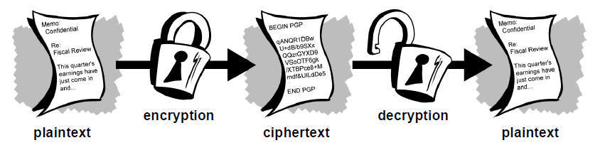

# Introduction to Cyber Security & Cryptography

> **"There are two kinds of cryptography in this world: cryptography that will stop your kid sister from reading your files, and cryptography that will stop major governments from reading your files. This course is about the latter."**  
> — _Bruce Schneier, Applied Cryptography: Protocols, Algorithms, and Source Code in C (rephrased)_

---

## 📚 Table of Contents

1. [What is Cyber Security?](#what-is-cyber-security)
2. [Can We Achieve Perfect Security?](#can-we-achieve-perfect-security)
3. [So What’s the Goal?](#so-whats-the-goal)
4. [What is Cryptography?](#what-is-cryptography)
5. [Basic Cryptographic Terminology](#basic-cryptographic-terminology)
6. [Goals of Cryptography](#goals-of-cryptography)
7. [Applications of Cryptography](#applications-of-cryptography)
8. [Core Idea of Cryptographic Design](#core-idea-of-cryptographic-design)
9. [Things to Remember](#things-to-remember)
10. [Categorization of Classical Ciphers](#categorization-of-classical-ciphers)
11. [Summary](#summary)

---

## What is Cyber Security?

> _How individuals and organisations reduce the risk of cyber attacks—protecting devices and services (online and offline) from theft or damage._

### Is this a hard task?

- Must anticipate all possible attacks before the attacker does.
- Defenders must secure everything; attackers only need one exploit.
- Digital systems are optimized for **utility**, not **security**.
- > _"A good attack is one that the engineers never thought of."_ — Bruce Schneier
- > _"If one overlooks the basement windows while assessing the risks to one’s house, it does not matter how many alarms are put on the doors and upstairs windows."_ — Melissa Danforth

---

## Can We Achieve Perfect Security?

> Realistically, **perfect security** is unattainable in practical systems.

- > _"The three golden rules to ensure computer security are: do not own a computer; do not power it on; and do not use it."_ — Robert H. Morris
- > _"The only way to protect your computer is to turn it off, encase it in cement, and bury it."_ — Prof. Fred Chang

---

## So What’s the Goal?

Security must be **balanced** with:

- Functionality  
- Usability  
- Efficiency  
- Time-to-market  
- Simplicity

---

## What is Cryptography?

- The study of **secret communication** (Greek: *kryptós* = hidden).
- Encompasses:
  - Mathematical techniques
  - Algorithm/protocol design

### Related terms

- **Cryptanalysis**: Breaking cryptographic algorithms.
- **Cryptology** = Cryptography + Cryptanalysis

---

## Basic Cryptographic Terminology

- **Plaintext**: The original message.
- **Encryption**: Turning plaintext into unreadable text.
- **Ciphertext**: Encrypted message.
- **Decryption**: Reverting ciphertext back to plaintext.
- **Cipher**: The algorithm used for encryption/decryption.
- **Keys**: Parameters that drive the cipher.

> **Note**: Encryption is meaningless without decryption (and vice versa).

---

## Goals of Cryptography

Ensure **secure communication** over an **insecure medium**.

### Secure communication means:

- **Confidentiality** – Only intended recipient can read the message.
- **Integrity** – Detect tampering or alteration.
- **Authentication** – Verify sender's identity.
- **Non-repudiation** – Sender cannot deny sending the message.

### What is an insecure medium?

- **Passive attacker** – Eavesdrops on communication.
- **Active attacker** – Modifies, injects, or blocks messages.

---

## Applications of Cryptography

### Classical uses:

- Pseudo-random number generation  
- Secret sharing  
- Digital signatures

### Modern uses:

- Blockchain (e.g., Bitcoin)  
- Zero-knowledge proofs  
- Electronic voting systems

---

## Core Idea of Cryptographic Design

1. Define a clear **threat model**.
2. Propose a **construction** (algorithm/protocol).
3. Prove that breaking it implies solving a **hard problem**.
4. Securely **implement** the design in practice.

---

## Things to Remember

### Cryptography **is**:

- A powerful tool in the security arsenal.
- The foundation of many secure technologies.

### Cryptography **is not**:

- A cure-all for security problems.
- Secure if badly implemented or misunderstood.
- Something you should "invent" yourself (!)

> ⚠️ Use vetted, battle-tested libraries and standards.

---

## Categorization of Classical Ciphers

> Classical ciphers are simpler than modern cryptosystems, but they laid essential groundwork for the field.

### Concealment Ciphers

- Hide the **existence** of the message itself.
- Techniques: invisible ink, microdots.
- Historically used by spies (e.g., Mary, Queen of Scots).

### Substitution Ciphers

- Replace each letter with another.
- Examples: Caesar Cipher, Vigenère Cipher.

### Transposition Ciphers

- Rearrange existing letters to scramble the message.
- Example: Spartan **Scytale** – parchment wrapped around a rod to reveal the correct message order.

> Note: Some classical ciphers combine substitution and transposition.

---

## Summary

- Cybersecurity is the practice of reducing risk in a world of interconnected systems.
- Cryptography underpins much of cybersecurity, enabling privacy, integrity, and trust.
- While perfect security is infeasible, good cryptography is a **powerful defense** when used correctly.
- Classical ciphers provide foundational concepts that evolved into modern cryptographic primitives.
- Always respect the complexity of implementation—cryptography is not DIY.

---
