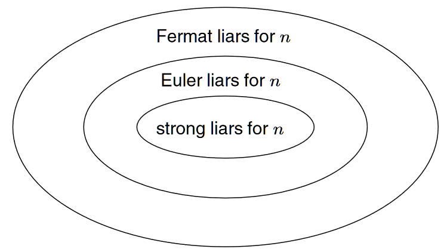

# Prime Numbers (Part 2 – Primality Testing)

- [Prime Numbers (Part 2 – Primality Testing)](#prime-numbers-part-2--primality-testing)
  - [Naive Brute Force Technique](#naive-brute-force-technique)
    - [Improving the Naive Test](#improving-the-naive-test)
  - [Sieve of Eratosthenes](#sieve-of-eratosthenes)
    - [The basic sieve](#the-basic-sieve)
    - [Red and Blue Primes Modulo 4 🟥🟦](#red-and-blue-primes-modulo-4-)
- [Primality Testing](#primality-testing)
  - [Probabilistic Primality Tests](#probabilistic-primality-tests)
  - [Fermat Primality Test](#fermat-primality-test)
    - [Limitations: Carmichael Numbers](#limitations-carmichael-numbers)
  - [Solovay–Strassen Primality Test](#solovaystrassen-primality-test)
    - [Euler's Criterion](#eulers-criterion)
  - [Miller–Rabin Primality Test](#millerrabin-primality-test)
    - [Square Roots of 1 mod $p$](#square-roots-of-1-mod-p)
    - [The Miller–Rabin Conditions](#the-millerrabin-conditions)
    - [Empirical: Which Bases Catch 41041?](#empirical-which-bases-catch-41041)
  - [Bonus material about Prime Conspiracy](#bonus-material-about-prime-conspiracy)
  - [Wrap Up and Next Steps](#wrap-up-and-next-steps)

In Part 1 of this series on prime numbers, we discussed how libraries such as `PyCryptodome` (`isPrime`) and SageMath (`is_prime`) allow us to test whether a given number \( n \) is prime. 

However, what if we wanted to implement our own primality test or use faster, more sophisticated methods?  
In this part, we will:

- First build a *naive primality test* based on brute-force.
- Then improve it incrementally to make it faster.
- Finally, introduce well-known primality tests such as **Fermat's Test**, **Solovay-Strassen Test** and **Miller-Rabin Test**.

---

## Naive Brute Force Technique

Before diving into optimized techniques, we state *basic brute-force primality test*.  
To test whether a number \( n \) is prime, we simply check whether any number between \( 2 \) and \( n-1 \) divides \( n \).

A basic implementation in Python is the following:

```python
def is_prime(n):
    '''
    Checks whether the argument n is a prime number.
    Uses a brute force search for factors between 2 and n-1.
    '''
    for j in range(2, n):
        if n % j == 0:
            print(f"{j} is a factor of {n}.")
            return False
    return True
```

Alternatively, using a `while` loop:

```python
def is_prime(n):
    '''
    Checks whether the argument n is a prime number.
    Uses a brute force search for factors between 2 and n-1.
    '''
    j = 2
    while j < n:
        if n % j == 0:
            print(f"{j} is a factor of {n}.")
            return False
        j += 1
    return True
```

One question may come to mind...why can we stop at the square root? If \( n \) is not prime, it must have two factors \( a \) and \( b \) such that \( ab = n \).  At least one of \( a \) or \( b \) must be less than or equal to \( \sqrt{n} \).  Thus, it suffices to check divisibility up to \( \sqrt{n} \) instead of \( n-1 \), which significantly improves efficiency.

To compute square roots in Python, we use: `from math import sqrt`. Simple as that. Just a slight explanation below of the ways we can import the `sqrt`.

```
### Different Import Styles for `sqrt`

- `from math import sqrt`: Directly imports `sqrt`. You can use `sqrt(1000)`.
- `import math`: Imports the full module. You must call `math.sqrt(1000)`.
- `from math import *`: Imports all functions, but risks naming conflicts. Use cautiously.
- `import math as mth`:  Aliases the module as `mth`, so you call `mth.sqrt(1000)`.
```

### Improving the Naive Test

Using the square root trick, we can now improve our naive primality test. We present two optimized versions below:

```python
from math import sqrt

def is_prime_slow(n):
    '''
    Checks whether n is a prime number.
    Searches for factors from 2 up to sqrt(n),
    but recomputes sqrt(n) in each iteration.
    '''
    j = 2
    while j <= sqrt(n):
        if n % j == 0:
            print(f"{j} is a factor of {n}.")
            return False
        j += 1
    return True
```

```python
from math import sqrt

def is_prime_fast(n):
    '''
    Checks whether n is a prime number.
    Searches for factors from 2 up to sqrt(n),
    computing sqrt(n) once before the loop.
    '''
    j = 2
    root_n = sqrt(n)
    while j <= root_n:
        if n % j == 0:
            print(f"{j} is a factor of {n}.")
            return False
        j += 1
    return True
```

We’ve defined three primality testing functions: `is_prime`, `is_prime_slow`, and `is_prime_fast`. While all three aim to determine whether a number $n$ is prime, `is_prime_slow` and `is_prime_fast` are more optimized than the original `is_prime` — with `is_prime_fast` being the most efficient of the three.

To rigorously compare their performance, we use Python’s `timeit` module. This module executes the given code multiple times and reports the average runtime, making it ideal for performance benchmarking in non-interactive environments.

```python
import timeit

# Example number to test for primality
n = 10**5 + 7

# Measure execution times
t1 = timeit.timeit('is_prime(n)', globals=globals(), number=10)
t2 = timeit.timeit('is_prime_slow(n)', globals=globals(), number=10)
t3 = timeit.timeit('is_prime_fast(n)', globals=globals(), number=10)

print(f"is_prime:      {t1:.6f} seconds (avg over 10 runs)")
print(f"is_prime_slow: {t2:.6f} seconds (avg over 10 runs)")
print(f"is_prime_fast: {t3:.6f} seconds (avg over 10 runs)")
```

But why is the fast version faster? When \( n \) is prime:

- `is_prime(n)` iterates roughly \( n \) times.
- `is_prime_fast(n)` iterates roughly \( \sqrt{n} \) times.

Since \( \sqrt{n} \ll n \) for large \( n \), the optimized version is significantly faster.

Between `is_prime_slow` and `is_prime_fast`, the key difference is:

- `is_prime_fast` **precomputes** \( \sqrt{n} \) once before entering the loop.
- `is_prime_slow` recomputes \( \sqrt{n} \) in every iteration.

Although Python is often optimized to cache such computations, explicitly storing \( \sqrt{n} \) avoids any overhead and ensures maximum efficiency.  
This follows a fundamental principle of programming: *avoid unnecessary repeated computations* when possible.

---

## Sieve of Eratosthenes

Before continuing with deeper primality tests, we take a brief detour to introduce the *Sieve of Eratosthenes*.  
The motivation for discussing it at this stage is that the Sieve provides an extremely efficient method for generating long lists of prime numbers, without the need for repeated primality testing.

The basic idea of the Sieve is simple:  
- Start with all natural numbers up to a given limit.
- Successively "sieve out" the multiples of \( 2 \), then \( 3 \), then \( 5 \), and so on.
- At the end, the numbers that remain unsieved are exactly the primes.

This sieving process progressively removes composite numbers by marking multiples of each prime as non-prime. You can read more about the concept of a sieve here: [Wikipedia: Sieve](https://en.wikipedia.org/wiki/Sieve).

Using list slicing and careful optimizations, we can implement the Sieve of Eratosthenes *very efficiently*, and it becomes a powerful tool for generating primes in bulk.

### The basic sieve

The first approach we introduce is a bit naive, but is a good starting place.  We will begin with a list of numbers up to 100, and sieve out the appropriate multiples of 2,3,5,7.

```python
primes = list(range(100)) # Let's start with the numbers 0...99.
```

Now, to "filter", i.e., to say that a number is *not* prime, let's just change the number to the value `None`.  

```python
primes[0] = None # Zero is not prime.
primes[1] = None # One is not prime.
print(primes) # What have we done?
```
Now let's filter out the multiples of 2, starting at 4.  This is the slice `primes[4::2]`

```python
primes[4::2] = [None] * len(primes[4::2])  # The right side is a list of Nones, of the necessary length.
print(primes) # What have we done?
```
Now we filter out the multiples of 3, starting at 9.

```python
primes[9::3] = [None] * len(primes[9::3])  # The right side is a list of Nones, of the necessary length.
print(primes) # What have we done?
```
Next the multiples of 5, starting at 25 (the first multiple of 5 greater than 5 that's left!)

```python
primes[25::5] = [None] * len(primes[25::5])  # The right side is a list of Nones, of the necessary length.
print(primes) # What have we done?
```

Finally, the multiples of 7, starting at 49 (the first multiple of 7 greater than 7 that's left!)

```python
primes[49::7] = [None] * len(primes[49::7])  # The right side is a list of Nones, of the necessary length.
print(primes) # What have we done?
```

What's left?  A lot of `None`s and the prime numbers up to 100.  We have successfully sieved out all the nonprime numbers in the list, using just four sieving steps (and setting 0 and 1 to `None` manually).  

But there's a lot of room for improvement, from beginning to end!

1.  The format of the end result is not so nice.
2.  We had to sieve each step manually.  It would be much better to have a function `prime_list(n)` which would output a list of primes up to `n` without so much supervision.
3.  The memory usage will be large, if we need to store all the numbers up to a large `n` at the beginning.

We solve these problems in the following way.

1.  We will use a list of *booleans* rather than a list of numbers.  The ending list will have a `True` value at prime indices and a `False` value at composite indices.  This reduces the memory usage and increases the speed.  
2.  A `which` function will make the desired list of primes after everything else is done.
3.  We will proceed through the sieving steps algorithmically rather than entering each step manually.

Here is a somewhat efficient implementation of the Sieve in Python.

```python
def isprime_list(n):
    ''' 
    Return a list of length n+1
    with Trues at prime indices and Falses at composite indices.
    '''
    flags = [True] * (n+1)  # A list [True, True, True,...] to start.
    flags[0] = False  # Zero is not prime.  So its flag is set to False.
    flags[1] = False  # One is not prime.  So its flag is set to False.
    p = 2  # The first prime is 2.  And we start sieving by multiples of 2.
    
    while p <= sqrt(n):  # We only need to sieve by p is p <= sqrt(n).
        if flags[p]:  # We sieve the multiples of p if flags[p]=True.
            flags[p*p::p] = [False] * len(flags[p*p::p]) # Sieves out multiples of p, starting at p*p.
        p = p + 1 # Try the next value of p.
        
    return flags
```
If you look carefully at the list of booleans, you will notice a `True` value at the 2nd index, the 3rd index, the 5th index, the 7th index, etc..  The indices where the values are `True` are precisely the **prime** indices.  Since booleans take the smallest amount of memory of any data type (one **bit** of memory per boolean), your computer can carry out the `isprime_list(n)` function even when `n` is very large.

To be more precise, there are 8 bits in a **byte**.  There are 1024 bytes (about 1000) in a kilobyte.  There are 1024 kilobytes in a megabyte.  There are 1024 megabytes in a gigabyte.  Therefore, a gigabyte of memory is enough to store about 8 billion bits.  That's enough to store the result of `isprime_list(n)` when `n` is about 8 billion.  Not bad!  And your computer probably has 4 or 8 or 12 or 16 gigabytes of memory to use.

```python
def where(L):
    '''
    Take a list of booleans as input and
    outputs the list of indices where True occurs.
    '''
    return [n for n in range(len(L)) if L[n]]
    
```
Combined with the `isprime_list` function, we can produce long lists of primes.

```python
print(where(isprime_list(100)))
```

Let's push it a bit further.  How many primes are there between 1 and 1 million?  We can figure this out in three steps:

1.  Create the isprime_list.
2.  Use where to get the list of primes.
3.  Find the length of the list of primes.

But it's better to do it in two steps.

1.  Create the isprime_list.
2.  Sum the list!  (Note that `True` is 1, for the purpose of summation!)

```python
print(where(isprime_list(100)))

print(sum(isprime_list(1000000)))  # The number of primes up to a million!

t1 = timeit.timeit('sum(isprime_list(1000000))', globals=globals(), number=1)
print(t1)
```

We dont stop here! The first improvement is to take care of the even numbers first.  If we count carefully, then the sequence 4,6,8,...,n (ending at n-1 if n is odd) has the floor of (n-2)/2 terms.  Thus the line `flags[4::2] = [False] * ((n-2)//2)` will set all the flags to False in the sequence 4,6,8,10,...  From there, we can begin sieving by *odd* primes starting with 3.

The next improvement is that, since we've already sieved out all the even numbers (except 2), we don't have to sieve out again by *even multiples*.  So when sieving by multiples of 3, we don't have to sieve out 9,12,15,18,21,etc..  We can just sieve out 9,15,21,etc..  When `p` is an odd prime, this can be taken care of with the code `flags[p*p::2*p] = [False] * len(flags[p*p::2*p])`.  

```python
def isprime_list_fast(n):
    ''' 
    Return a list of length n+1
    with Trues at prime indices and Falses at composite indices.
    '''
    flags = [True] * (n+1)  # A list [True, True, True,...] to start.
    flags[0] = False  # Zero is not prime.  So its flag is set to False.
    flags[1] = False  # One is not prime.  So its flag is set to False.
    flags[4::2] = [False] * ((n-2)//2)
    p = 3
    while p <= sqrt(n):  # We only need to sieve by p is p <= sqrt(n).
        if flags[p]:  # We sieve the multiples of p if flags[p]=True.
            flags[p*p::2*p] = [False] * len(flags[p*p::2*p]) # Sieves out multiples of p, starting at p*p.
        p = p + 2 # Try the next value of p.  Note that we can proceed only through odd p!
        
    return flags
```

```python
t2 = timeit.timeit('sum(isprime_list_fast(1000000))', globals=globals(), number=1)
print(t2)
```
Another modest improvement is the following.  In the code above, the program *counts* the terms in sequences like 9,15,21,27,..., in order to set them to `False`.  This is accomplished with the length command `len(flags[p*p::2*p])`.  But that length computation is a bit too intensive.  A bit of algebraic work shows that the length is given formulaically in terms of `p` and `n` by the formula:  

$$len = \lfloor \frac{n - p^2 - 1}{2p} \rfloor + 1$$

(Here $\lfloor x \rfloor$ denotes the floor function, i.e., the result of rounding down.)  Putting this into the code yields the following.

```python
def isprime_list_fastest(n):
    ''' 
    Return a list of length n+1
    with Trues at prime indices and Falses at composite indices.
    '''
    flags = [True] * (n+1)  # A list [True, True, True,...] to start.
    flags[0] = False  # Zero is not prime.  So its flag is set to False.
    flags[1] = False  # One is not prime.  So its flag is set to False.
    flags[4::2] = [False] * ((n-2)//2)
    p = 3
    while p <= sqrt(n):  # We only need to sieve by p is p <= sqrt(n).
        if flags[p]:  # We sieve the multiples of p if flags[p]=True.
            flags[p*p::2*p] = [False] * ((n-p*p-1)//(2*p)+1) # Sieves out multiples of p, starting at p*p.
        p = p + 2 # Try the next value of p.
        
    return flags


t3 = timeit.timeit('sum(isprime_list_fastest(1000000))', globals=globals(), number=1)
print(t3)
```
The code was heavily influenced by the [discussion on StackOverflow](https://stackoverflow.com/questions/2068372/fastest-way-to-list-all-primes-below-n). If we wanted a more serious analysis, we should have used the method of *list comprehension* to place our population into "bins" for statistical analysis, but we dont care about this at this stage. 

###  Red and Blue Primes Modulo 4 🟥🟦

Let’s divide the *odd prime numbers* into two groups based on their remainder when divided by 4:

* **Red primes**: Primes of the form $4n + 1$, or in Python: `p % 4 == 1`
* **Blue primes**: Primes of the form $4n + 3$, or: `p % 4 == 3`
* The prime **2** doesn’t belong to either group since it’s even.

Suppose you already have a list of primes called `primes` (e.g., all primes up to 1 million):

```python
# Divide primes into red and blue
red_primes = [p for p in primes if p % 4 == 1]
blue_primes = [p for p in primes if p % 4 == 3]

# Show first 20 from each group
print("First 20 red primes:", red_primes[:20])
print("First 20 blue primes:", blue_primes[:20])
```

Let’s see how many red and blue primes there are up to 1 million:

```python
print("There are {} red primes and {} blue primes up to 1 million.".format(len(red_primes), len(blue_primes)))
```

This usually shows that the two groups are *very close in size*. In fact, mathematicians have proven that over the long run (as $n \to \infty$), the number of red and blue primes becomes *nearly equal*.

However, the great mathematician Chebyshev observed that *blue primes tend to appear slightly more often* than red primes for small and medium-sized numbers — a small but persistent bias ([Chebyshev's bias (Wikipedia)](https://en.wikipedia.org/wiki/Chebyshev%27s_bias)).

If you have a list of all primes up to some large number, here’s a quick way to count how many are ≤ a specific value:

```python
def primes_up_to(x):
    return len([p for p in primes if p <= x])
```

Usage example:

```python
print(primes_up_to(1000))  # Output: 168
```

This tells us there are 168 primes less than or equal to 1000. 

Now we can return to our original goal, talking about primality tests!

# Primality Testing

## Probabilistic Primality Tests

Probabilistic primality tests are algorithms used to test whether a given positive integer is *probably prime* or *definitely composite*. These tests do not provide certainty for primality, but they offer increasing confidence with repeated trials.

The basic idea is that given an odd integer $n > 2$, define a subset $W(n) \subset \mathbb{Z}_n$ satisfying the following properties:

1. For any $a \in \mathbb{Z}_n$, we can deterministically verify whether $a \in W(n)$ in polynomial time.
2. If $n$ is prime, then $W(n) = \emptyset$.
3. If $n$ is composite, then $|W(n)| \geq \frac{n}{2}$.


* If $n$ is composite, the elements of $W(n)$ are called *witnesses* to the compositeness of $n$.
* The elements of the complement set $L(n) = \mathbb{Z}_n \setminus W(n)$ are called *liars*, as they falsely suggest $n$ might be prime.

Our testing framework will be the following:

1. Choose a random $a \in \mathbb{Z}_n$.
2. Check if $a \in W(n)$.

   * If *yes*, return *composite*: $n$ is certainly not prime.
   * If *no*, return *probably prime*: no conclusion can be drawn, but $n$ has passed one round.

Note however that: 

* The more rounds $n$ passes without a witness, the more confident we become in its primality.
* Probabilistic tests trade off certainty for computational efficiency, especially useful for large numbers in cryptographic applications.

---

## Fermat Primality Test

First, lets state the *Fermat’s Little Theorem* (FLT): 

Let $p$ be a prime and $a \in \mathbb{Z}$ such that $\gcd(a, p) = 1$. Then:

$$
a^{p-1} \equiv 1 \pmod{p}
$$

We gonna use the *contrapositive* of the theorem:

* If for some $a \in \mathbb{Z}_n$ with $\gcd(a, n) = 1$, we find $a^{n-1} \not\equiv 1 \pmod{n}$, then $n$ is *definitely composite*!

The algorithm: 

* Input: an integer $n > 3$ and number of iterations $k$.
* Repeat the following $k$ times:

  1. Pick a random base $a \in \{2, \ldots, n - 2\}$.
  2. If $\gcd(a, n) \neq 1$, skip this iteration (or return composite as a valid factor is found).
  3. If $a^{n-1} \not\equiv 1 \pmod{n}$, return *composite*.
* If all tests pass, return *probably prime*.

Below is a basic Python implementation  called `fermattest.py` in the `src` folder: 

```python
from Crypto.Util.number import getPrime
import random
from math import gcd as GCD

def fermat_test(n, k):
    for _ in range(k):
        a = random.randint(2, n - 2)
        if GCD(a, n) != 1:
            continue  # You may optionally return 'Composite' here instead
        if pow(a, n - 1, n) != 1:
            return 'Composite'
    return 'Probably prime'    
print(fermat_test(2403, 12))  # Composite number

p = getPrime(512)
print(fermat_test(p, 100))   # Large probable prime    
```


### Limitations: Carmichael Numbers

*Carmichael numbers* are composite integers that nevertheless pass the Fermat test for **all** bases $a$ coprime to them:

$$
a^{n-1} \equiv 1 \pmod{n}, \quad \forall \, a \text{ with } \gcd(a,n) = 1
$$

Hence, Fermat’s test *fails* to detect their compositeness.

A few examples that highlight the flaw: Carmichael numbers **always pass Fermat’s test**, regardless of the number of trials.

```python
print(f"561 is {fermat_test(561, 100)} but 561 % 3 = {561 % 3}")     # 561 is Carmichael
print(f"41041 is {fermat_test(41041, 100)} but 41041 % 11 = {41041 % 11}")  # 41041 is also Carmichael
```
---

## Solovay–Strassen Primality Test

Although ultimately superseded in practice by the *Miller–Rabin test*, which we analyse later, the Solovay–Strassen test offers an important theoretical improvement over Fermat’s test. It resolves the issue of *Carmichael numbers* by incorporating *Euler's criterion* and the *Jacobi symbol*, thus detecting a larger class of composites more effectively.


### Euler's Criterion

Let $p$ be an odd prime, and let $a \in \mathbb{Z}$ with $\gcd(a, p) = 1$. Then:

$$
a^{(p-1)/2} \equiv \left( \frac{a}{p} \right) \pmod{p}
$$

Where $\left( \frac{a}{p} \right)$ denotes the *Legendre symbol*. This criterion allows us to probabilistically detect compositeness by testing whether a candidate number satisfies this congruence.


We gonna generalize Euler’s criterion to odd *composite* integers $n$, using the *Jacobi symbol* $\left( \frac{a}{n} \right)$, which is defined for any odd integer $n \geq 3$ and any integer $a$, regardless of whether $n$ is prime.

Let $n$ be an odd composite number and $a \in \{2, 3, \ldots, n-2\}$:

* If either:

  * $\gcd(a, n) > 1$, or
  * $a^{(n−1)/2} \not\equiv \left( \frac{a}{n} \right) \pmod{n}$,
    then $a$ is called an **Euler witness** to the compositeness of $n$.

* Otherwise, if:

  * $\gcd(a, n) = 1$, and
  * $a^{(n−1)/2} \equiv \left( \frac{a}{n} \right) \pmod{n}$,
    then $n$ is said to be an **Euler pseudoprime** to the base $a$, and $a$ is called an **Euler liar**.

The algorithm's pseudocode is following:

* Input: An odd integer $n > 2$, and number of iterations $k$
* Repeat $k$ times:

  1. Choose random $a \in \{2, \ldots, n - 2\}$
  2. If $\gcd(a, n) \neq 1$, return *composite*
  3. Compute $r = a^{(n-1)/2} \bmod n$
  4. Compute $\left( \frac{a}{n} \right)$, the Jacobi symbol
  5. If $r \not\equiv \left( \frac{a}{n} \right) \pmod{n}$, return *composite*
* If no witness is found in $k$ rounds, return *probably prime*

The full implementation can be found in the `src` folder named `solovaystrassen.py`, where you can can also use a custom  `jacobi_symbol` implementation, instead of loading `from sympy.ntheory import jacobi_symbol`.


## Miller–Rabin Primality Test

The *Miller–Rabin test* is a powerful probabilistic primality test that improves upon Fermat and Solovay–Strassen by detecting a smaller and more effective set of *liars*. It is based on analyzing square roots of 1 modulo a candidate number, and uses the structure of the multiplicative group modulo $n$ more deeply.

Before we proceed we need some *new* mathematical background.

###  Square Roots of 1 mod $p$

Let $p$ be an odd prime. Consider the modular equation:

$$
x^2 \equiv 1 \pmod{p}
$$

This implies:

$$
(x - 1)(x + 1) \equiv 0 \pmod{p}
$$

Since $p$ is prime, the only solutions are $x \equiv \pm 1 \pmod{p}$.


### The Miller–Rabin Conditions

Let $n > 2$ be an **odd integer**, and write:

$$
n - 1 = 2^r \cdot s \quad \text{with } s \text{ odd}
$$

Let $a \in \mathbb{Z}_n^*$ be a base such that $\gcd(a, n) = 1$. Then, if $n$ is prime, *one* of the following must be true:

1. $a^s \equiv 1 \pmod{n}$, or
2. For some $0 \leq j < r$, $a^{2^j s} \equiv -1 \pmod{n}$

The *contrapositive* forms the basis of the test:
If neither condition holds for some base $a$, then $n$ is *definitely composite*, and $a$ is called a *strong witness*.

If either condition is satisfied, $n$ is *probably prime* with respect to base $a$, and $a$ is a *strong liar*.


>Pingala's algorithm, drawing inspiration from the ancient binary numeral system described in Pingala’s *Chandahsutra*, is effective for computing powers, both in ordinary arithmetic and in modular arithmetic. In modern terms, this method corresponds to *binary exponentiation* (also known as *square-and-multiply*), an efficient algorithm that computes $a^b \mod n$ in $O(\log b)$ time by exploiting the binary expansion of the exponent. This technique not only speeds up calculations but also allows us to analyze each intermediate squaring step. By doing so, we can detect violations of *Fermat’s Little Theorem* and, more subtly, observe instances where the *roots of unity (ROU) property* of primes fails. These violations act as strong witnesses to compositeness and enhance the reliability of probabilistic primality tests such as Miller–Rabin.

For a detailed treatment of the algorithm, see: Knuth, Donald E. *The Art of Computer Programming*, Vol. 2: Seminumerical Algorithms, 3rd ed., Addison-Wesley, 1997, §4.6.3.

To better understand how modular exponentiation works, let’s write a *verbose version* of Pingala’s algorithm — a method that efficiently calculates powers like $a^b \mod n$ using the binary digits of the exponent.

```python
def powmod_verbose(base, exponent, modulus):
    result = 1
    print("Computing {} raised to {}, modulo {}.".format(base, exponent, modulus))
    print("The current number is {}".format(result))
    bitstring = bin(exponent)[2:] # Chop off the '0b' part of the binary expansion of exponent
    for bit in bitstring: # Iterates through the "letters" of the string.  Here the letters are '0' or '1'.
        sq_result = result*result % modulus  # We need to compute this in any case.
        if bit == '0':
            print("BIT 0:  {} squared is congruent to {}, mod {}".format(result, sq_result, modulus))
            result = sq_result 
        if bit == '1':
            newresult = (sq_result * base) % modulus
            print("BIT 1:  {} squared times {} is congruent to {}, mod {}".format(result, base, newresult, modulus))
            result = newresult
    return result
```

If we call this with:

```python
print(powmod_verbose(2, 560, 561))
```

We compute $2^{560} \mod 561$, showing each step. Interestingly, this returns 1 — which normally suggests that 561 *might be prime* based on FLT.

However, 561 is *not* prime (it's a Carmichael number). And if you look carefully at the output, you’ll notice that at some point in the computation, a number like 67 appears such that:

$$
67^2 \equiv 1 \mod 561
$$

This is a problem. If 561 was prime, then the only square roots of 1 modulo 561 should be just 1 and 560. Since 67 is neither, we’ve found a violation of what's called the *ROUs property* — a red flag that the number is composite.

This observation leads to the *Miller–Rabin primality test*. It runs a version of Pingala’s algorithm:

* If it sees that the result is not 1 at the end, it catches a *Fermat violation*.
* If it notices any unexpected square root of 1 along the way (like the 67 above), that’s a *ROU violation*.

Either case proves the number is *definitely not prime*, even if we never find an actual factor.

A naive implementation lives in `src/naivemillerrabin.py`, where we test an integer `n` for primality by running `k` Miller–Rabin rounds with independently chosen random bases in the range $[2, n-2]$.But does simply doing $k$ random rounds actually catch most composites? The answer lies in both experiment and theory.

### Empirical: Which Bases Catch 41041?
Let's see how many witnesses observe the nonprimality of 41041. The code is `src/primewitness.py`.

```python
for witness in range(2,20):
    MR = Miller_Rabin(41041, witness) # 
    if MR: 
        print("{} is a bad witness.".format(witness))
    else:
        print("{} detects that 41041 is not prime.".format(witness))
```

In fact, one can prove that at least 3/4 of the witnesses will detect the non-primality of any non-prime.  Thus, if you keep on asking witnesses at random, your chances of detecting non-primality increase exponentially!  In fact, the witness 2 suffices to check whether any number is prime or not up to 2047.  In other words, if $p < 2047$, then $p$ is prime if and only if `Miller_Rabin(p,2)` is `True`.  Just using the witnesses 2 and 3 suffice to check primality for numbers up to a million (1373653, to be precise, according to [Wikipedia](https://en.wikipedia.org/wiki/Miller%E2%80%93Rabin_primality_test).)

The general strategy behind the Miller-Rabin test then is to use just a few witnesses for smallish potential primes (say, up to $2^{64}$).  For larger numbers, try some number $x$ (like 20 or 50) random bases.  If the tested number **is** composite, then the probability of all witnesses reporting `True` is is less than $1 / 4^x$.  With 50 random witnesses, the chance that a composite number tests as prime is less than $10^{-30}$.  
Note that these are statements about *conditional probability*.  In more formal language,
$$\text{Prob} \left( \text{tests prime} \ \vert \ \text{ is composite} \right) < \frac{1}{4^{\# \text{witnesses} } }.$$

Now we are in a strange situation:

>*The probability that a number is prime, given that it tests prime.*

The relationship between the two probabilities is given by Bayes Theorem, and depends on the *prevalence* of primes among the sample.  If our sample consists of numbers of absolute value about $N$, then the prevalence of primes will be about $1 / \log(N)$, and the probability of primality given a positive test result can be approximated. 
$$\text{Prob} \left( \text{ is prime } \ \vert \ \text{ tests prime } \right) > 1 - \frac{\log(N) - 1}{4^{\# \text{witnesses}}}.$$
As one chooses more witnesses, this probability becomes extremely close to $1$. Check the code in the `src` folder, under `primewitness.py`. In this way, we can test primality of numbers of hundreds of digits!

For an application, let's find some Mersenne primes.  Recall that a Mersenne prime is a prime of the form $2^p - 1$.  Note that when $2^p - 1$ is prime, it must be the case that $p$ is a prime too.  We will quickly find the Mersenne primes with $p$ up to 1000 below! Go add this at the end of `primewitness.py`.

```python
for p in range(1,1000):
    if is_prime(p):  # We only need to check these p.
        M = 2**p - 1 # A candidate for a Mersenne prime.
        if is_prime(M):
            print("2^{} - 1 = {} is a Mersenne prime.".format(p,M))
```


Now that we've seen how the Miller–Rabin test works — detecting compositeness through violations during modular exponentiation — it’s important to understand *why this test is so effective in practice*. The following three facts explain its reliability, efficiency, and how it's optimized in real-world applications:

* **Monier–Rabin Bound**: In the context of the Miller–Rabin test, a *strong liar* is a base $a \in \mathbb{Z}_n^*$ that falsely suggests a composite number $n$ is probably prime. The *Monier–Rabin bound* gives a *theoretical upper limit* on how many such bases can exist for any odd composite number $n \ne 9$:

$$
\left| \text{strong liars for } n \right| \leq \frac{\phi(n)}{4}
$$

* Here, $\phi(n)$ is Euler’s totient function — the number of integers less than $n$ that are coprime to $n$.
* So at most 25% of the possible bases can be strong liars.
* *In practice*, the number is usually much *smaller* — many composite numbers have very *few* bases that falsely report them as “probably prime”.

This means: *most random choices of $a$ will correctly detect compositeness* — and it’s very unlikely to repeatedly hit strong liars by chance.
* **Error Probability**: Since Miller–Rabin is a *probabilistic test*, there's a nonzero chance it could return "probably prime" for a composite number — if the base happens to be a strong liar.

However, because of the Monier–Rabin bound, each base you test has at most a *1/4 chance* (and often much less) of being a strong liar. So, the probability of making a mistake decreases *exponentially* with repeated trials:

$$
\text{Probability of false positive after } k \text{ independent tests} \leq \left( \frac{1}{4} \right)^k
$$

So for example:

* 10 random bases ⇒ ≤ $1/4^{10} \approx 10^{-6}$
* 20 random bases ⇒ ≤ $10^{-12}$
* 50 random bases ⇒ ≤ $10^{-30}$

This is why Miller–Rabin is so effective: even though it’s technically probabilistic, you can make the error probability as small as you want with enough random trials.
* **Fixed-Base Strategy**: Instead of choosing random bases each time, some implementations of Miller–Rabin use a *fixed set of small prime bases*, like:

$$
a \in \{2, 3, 5, 7, 11, 13, 17, \dots\}
$$

This *deterministic approach* works very well in practice for numbers below certain thresholds:

For example:

  * $a = 2$ suffices to correctly classify all $n < 2{,}047$
  * $a = \{2, 3\}$ suffices for $n < 1{,}373{,}653$
  * $a = \{2, 3, 5, 7, 11, 13, 17, 19, 23\}$ works for all $n < 2^{64}$

These bounds come from exhaustive testing and number theory results. In practical applications like RSA key generation, using these bases ensures safe and fast primality testing.

And it works because strong liars *tend not to cluster* — i.e., if one base fails to detect compositeness, the others almost always catch it. This makes fixed-base testing surprisingly effective for bounded integers.

So to summarize,

* **Monier–Rabin bound** ensures few bases can fool the test.
* **Random trials** quickly eliminate the risk of error.
* **Fixed small bases** work well for numbers below $2^{64}$, enabling safe and fast deterministic checks.


The following diagram illustrates the relationship between different types of liars under the three main probabilistic primality tests:



As shown:

* All *strong liars* (Miller–Rabin) are *Euler liars*, and
* All Euler liars are *Fermat liars*.
* Thus, Miller–Rabin has the smallest set of liars and is the most powerful test among the three.


## Bonus material about Prime Conspiracy

The article on the ["Prime Conspiracy"](https://www.quantamagazine.org/mathematicians-discover-prime-conspiracy-20160313) discusses a fascinating and unexpected statistical bias in the distribution of *last digits of consecutive prime numbers*, uncovered in 2016 by mathematicians Robert J. Lemke Oliver and Kannan Soundararajan.

Traditionally, number theorists assumed that *primes are "random-like"* in certain aspects — especially their final digits in base 10. Since all primes > 5 end in 1, 3, 7, or 9 (to avoid being divisible by 2 or 5), it was believed that these last digits should be *equally likely* and *uniformly distributed* among consecutive primes.

However, Lemke Oliver and Soundararajan *discovered a subtle bias*:

* For example, a prime ending in 3 is *less likely* to be followed by another prime ending in 3.
* Conversely, a prime ending in 3 is *more likely* to be followed by one ending in 9.

This contradicts the expected assumption of *independent uniform distribution* of last digits in successive primes.

Their empirical findings suggest:

* There are *unexpected correlations* between the last digits of successive primes.
* These correlations persist *even as numbers grow large*, although they tend to weaken.

This goes beyond just randomness — it hints at some underlying *structure* or *bias* in how primes are distributed, which had previously gone unnoticed.

This "prime conspiracy" is not a violation of any existing theorem but a *refinement of our understanding* of prime randomness. It’s a beautiful example of how *subtle patterns* emerge from deep mathematical structures — often lying just beneath what we thought was random.

## Wrap Up and Next Steps

Throughout this second part of our series on prime numbers, we've progressed from basic brute-force approaches to more sophisticated methods, greatly enhancing our efficiency and understanding of primality testing:

- Naive methods offered clarity but lacked efficiency, motivating incremental optimizations.

- Square-root optimizations and the Sieve of Eratosthenes introduced powerful tools for practical prime generation and testing.

- We delved into probabilistic tests—Fermat, Solovay–Strassen, and Miller–Rabin—each improving upon its predecessor by reducing errors and enhancing detection of composite numbers.

- Finally, we touched upon modern insights into prime number distribution, highlighting the intriguing "Prime Conspiracy," a subtle statistical anomaly uncovered by modern computational methods.

In the upcoming and final installment (Part III), we'll dive deeper into advanced techniques by exploring Arnault’s method, demonstrating how one might construct specific pseudoprimes capable of evading even robust tests like Miller–Rabin. This journey underscores the beauty and complexity within the seemingly straightforward domain of prime numbers.

