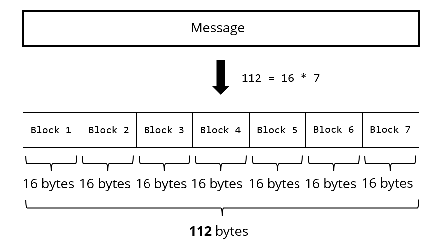
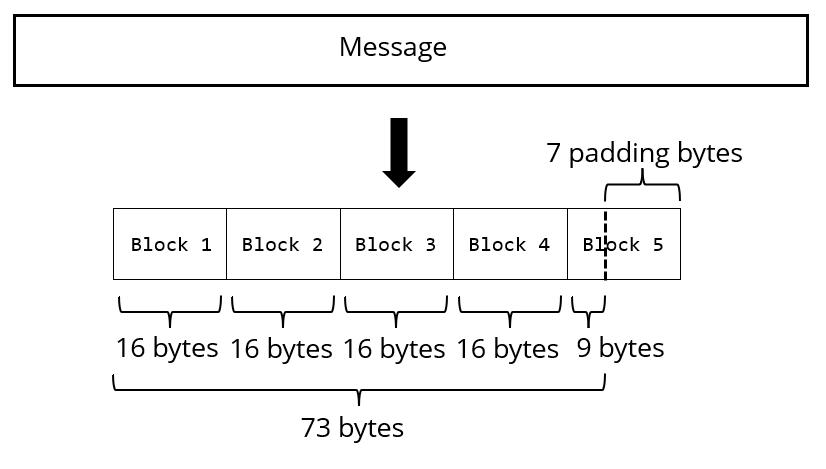
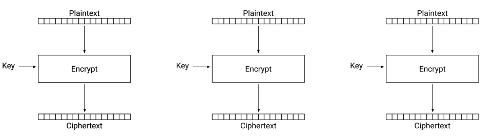
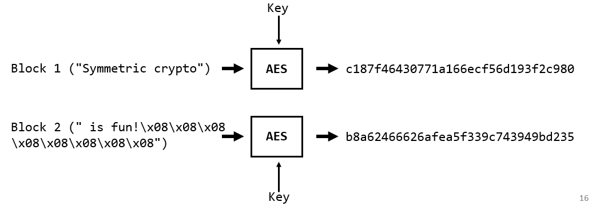
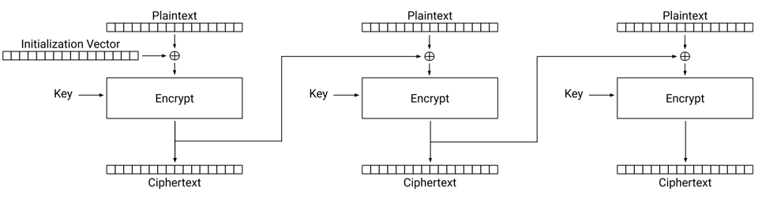
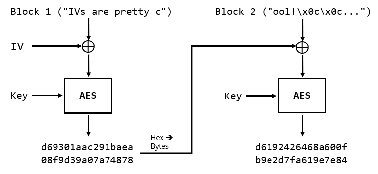
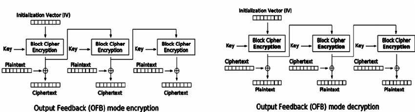
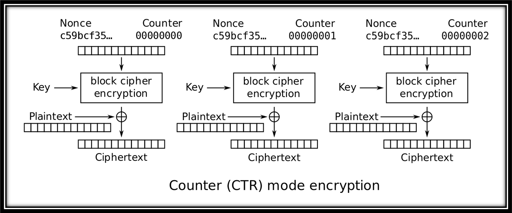

# Padding and Encryption modes 

- [Padding and Encryption modes](#padding-and-encryption-modes)
- [Introduction](#introduction)
- [PKCS#7 Padding](#pkcs7-padding)
  - [How PKCS#7 Works](#how-pkcs7-works)
  - [PKCS#7 Padding in Python](#pkcs7-padding-in-python)
    - [Example of Padding a String](#example-of-padding-a-string)
    - [Example of Padding a short message](#example-of-padding-a-short-message)
    - [Example of Padding another string](#example-of-padding-another-string)
- [Modes of Operation in Block Ciphers](#modes-of-operation-in-block-ciphers)
    - [Types of Encryption Schemes](#types-of-encryption-schemes)
    - [Key Questions in Analyzing Modes](#key-questions-in-analyzing-modes)
  - [Popular Modes of Operation](#popular-modes-of-operation)
    - [1. Electronic Codebook (ECB)](#1-electronic-codebook-ecb)
    - [2. Cipher Block Chaining (CBC)](#2-cipher-block-chaining-cbc)
    - [3. Counter Mode (CTR)](#3-counter-mode-ctr)
  - [Electronic Codebook (ECB) Mode](#electronic-codebook-ecb-mode)
    - [How ECB Works](#how-ecb-works)
    - [Parallelizability](#parallelizability)
    - [Security Analysis](#security-analysis)
      - [Strengths](#strengths)
      - [Weaknesses](#weaknesses)
    - [Example (Single Block):](#example-single-block)
    - [Example (Multi Blocks):](#example-multi-blocks)
  - [What actually happens in ECB mode?](#what-actually-happens-in-ecb-mode)
    - [Step 1: Padding](#step-1-padding)
    - [Step 2: Splitting into blocks](#step-2-splitting-into-blocks)
    - [Step 3: ECB Encryption](#step-3-ecb-encryption)
  - [Another Python example](#another-python-example)
    - [Step 1: Define the Key](#step-1-define-the-key)
    - [Step 2: Define and Inspect the Message](#step-2-define-and-inspect-the-message)
    - [Step 3: Apply Padding](#step-3-apply-padding)
    - [Step 4: Encrypt and Decrypt](#step-4-encrypt-and-decrypt)
    - [Step 5: Unpad to Recover the Original Message](#step-5-unpad-to-recover-the-original-message)
  - [ECB Weakness Demonstration – Identical Blocks Leak Patterns](#ecb-weakness-demonstration--identical-blocks-leak-patterns)
- [Cipher Block Chaining (CBC) Mode](#cipher-block-chaining-cbc-mode)
  - [Overview](#overview)
    - [What is an Initialization Vector (IV)?](#what-is-an-initialization-vector-iv)
  - [How CBC Works](#how-cbc-works)
    - [Encryption](#encryption)
    - [Decryption](#decryption)
  - [Parallelizability](#parallelizability-1)
  - [Security Analysis](#security-analysis-1)
    - [IV Security](#iv-security)
  - [CBC Mode – Python Example (Multi-Block Encryption)](#cbc-mode--python-example-multi-block-encryption)
    - [Encryption and Decryption](#encryption-and-decryption)
  - [CBC Mode Example with Patterned Message](#cbc-mode-example-with-patterned-message)
    - [Setup and Key/IV Generation](#setup-and-keyiv-generation)
    - [Demonstrating how ECB weakness is resolved in CBC mode](#demonstrating-how-ecb-weakness-is-resolved-in-cbc-mode)
- [Cipher Feedback Mode (CFB)](#cipher-feedback-mode-cfb)
  - [Overview](#overview-1)
  - [How CFB Works](#how-cfb-works)
    - [Encryption](#encryption-1)
    - [Decryption](#decryption-1)
  - [Parallelizability](#parallelizability-2)
  - [Security Analysis](#security-analysis-2)
  - [CFB Mode Coding Example and CPA Attack Demonstration](#cfb-mode-coding-example-and-cpa-attack-demonstration)
    - [Encryption and Decryption](#encryption-and-decryption-1)
    - [CFB CPA Attack](#cfb-cpa-attack)
    - [Step 1: Define Key and IV](#step-1-define-key-and-iv)
- [Output Feedback Mode (OFB)](#output-feedback-mode-ofb)
  - [Overview](#overview-2)
  - [How OFB Works](#how-ofb-works)
    - [Encryption](#encryption-2)
    - [Decryption](#decryption-2)
  - [Parallelizability](#parallelizability-3)
  - [Security Analysis](#security-analysis-3)
    - [Bit-Flipping Behavior](#bit-flipping-behavior)
    - [CPA Insecurity (again like CFB) with Reused IV](#cpa-insecurity-again-like-cfb-with-reused-iv)
  - [OFB Mode Example](#ofb-mode-example)
    - [Setup](#setup)
- [Counter Mode (CTR)](#counter-mode-ctr)
  - [Overview](#overview-3)
  - [How CTR Works](#how-ctr-works)
    - [Encryption](#encryption-3)
    - [Decryption](#decryption-3)
  - [Parallelizability](#parallelizability-4)
  - [Security Analysis](#security-analysis-4)
    - [Indistinguishability Under CPA](#indistinguishability-under-cpa)
    - [⚠️ Nonce Reuse](#️-nonce-reuse)
  - [CTR Mode Example](#ctr-mode-example)
    - [Setup](#setup-1)
- [Conclusion](#conclusion)

---
# Introduction 
We will explore **padding mechanisms, modes of operation, and practical implementations.**

We should have in mind that:

✔ Messages are **split into fixed-size blocks** before encryption.  
✔ In this guide, **16 bytes will be the default block length**.  
✔ If the message is **larger than 16 bytes**, a **block cipher mode of operation** is required to handle multiple blocks securely.  

A small example is the following: when the message length is a multiple of the block length (= 112 bytes)




Another example is when the message length is **not** a multiple of the block length (= 73 bytes)



# PKCS#7 Padding

**PKCS#7** is one of the most popular padding schemes used in block ciphers. It ensures that plaintext messages fit perfectly into fixed-size blocks required by encryption algorithms like **AES**.

## How PKCS#7 Works

✔ The **value of each padding byte** is equal to the **total number of padding bytes added**.  
✔ Used in **block cipher modes that require padding** (e.g., **CBC, ECB**).  

Consider the message **"Welcome"**, which has a length of **7 bytes**.  AES requires **16-byte blocks**, so the message must be **padded with 9 additional bytes**.

- **Block size** = 16 bytes  
- **Message size** = 7 bytes  
- **Padding required** = 16 - 7 = **9 bytes**  
- **Padding value** = `0x09` (since 9 bytes are added)  

Padded Message: `"Welcome\x09\x09\x09\x09\x09\x09\x09\x09\x09"`


This ensures the final message aligns perfectly with the **16-byte block size**.

---

PKCS#7 is widely used in cryptographic implementations, ensuring proper **message integrity** and **block alignment** during encryption. 🚀

## PKCS#7 Padding in Python

The **Crypto.Util.Padding** module in Python provides an easy way to **apply PKCS#7 padding** to messages.

### Example of Padding a String

```python
from Crypto.Util.Padding import pad

msg = b'This is padding!'
padded_msg = pad(msg, 16)

print(padded_msg)

output : b'This is padding!\x10\x10\x10\x10\x10\x10\x10\x10\x10\x10\x10\x10\x10\x10\x10\x10'

```

### Example of Padding a short message

```python
msg = b'Custom'
padded_msg = pad(msg, 16)

print(padded_msg)

output : b'Custom\n\n\n\n\n\n\n\n\n\n'

```
### Example of Padding another string

```python 
msg = b'AES is cool'
padded_msg = pad(msg, 16)

print(padded_msg)

output: b'AES is cool\x05\x05\x05\x05\x05'

```

- The pad() function adds bytes so that the total length is a multiple of the block size.
- The value of the padding byte is equal to the number of padding bytes added.
- In the last example, 5 bytes of 0x05 were added to make the total length a multiple of 16.

PKCS#7 padding is essential for block ciphers like AES, where messages must be aligned to a fixed block size.

# Modes of Operation in Block Ciphers

Block ciphers, such as AES, operate on fixed-size blocks of plaintext (e.g., 128 bits for AES-128). To encrypt messages longer than a single block, we employ *modes of operation*—methods for chaining block cipher calls to process data of arbitrary length securely.

Let $(E, D)$ be a block cipher with the following notation:
- $E, D : \mathcal{K} \times \{0,1\}^l \rightarrow \{0,1\}^l$  
- $m, c \in \{0,1\}^l$, where $l$ is the block size in bits.

Basic encryption and decryption are defined as:
- $c = E(k, m)$
- $m = D(k, c)$

Our objective is to extend this to:
- **Encryption:** $(c_1, c_2, \dots, c_n) \leftarrow \text{MODE}(k, m_1, m_2, \dots, m_n)$  
- **Decryption:** $(m_1, m_2, \dots, m_n) \leftarrow \text{MODE}^{-1}(k, c_1, c_2, \dots, c_n)$

### Types of Encryption Schemes

- **Deterministic Encryption:** The same plaintext encrypted with the same key always yields the same ciphertext.

- **Probabilistic Encryption:** Encryption incorporates randomness, so the same plaintext encrypted multiple times yields different ciphertexts. This is crucial for semantic security.

### Key Questions in Analyzing Modes

1. How does the mode operate?
2. What are its security guarantees and weaknesses?
3. Can it be implemented in parallel (encryption/decryption)?

We should take into account the following:

- Plaintext must be padded to align with the block size. **PKCS#7 padding** is a common method.
- Improper padding may lead to **padding oracle attacks**.
- Modes of operation define how blocks are linked or processed.

## Popular Modes of Operation

### 1. Electronic Codebook (ECB)

- Encrypts each block independently.
- Identical plaintext blocks yield identical ciphertext blocks.
- Not recommended for structured or sensitive data due to pattern leakage.

### 2. Cipher Block Chaining (CBC)

- Introduces an **Initialization Vector (IV)** to randomize encryption.
- Each plaintext block is XORed with the previous ciphertext block before encryption.
- Encryption is sequential (not parallelizable); decryption is parallelizable.

### 3. Counter Mode (CTR)

- Transforms a block cipher into a stream cipher.
- A counter value is encrypted to generate a keystream, which is then XORed with the plaintext.
- Both encryption and decryption are parallelizable.
- IV or nonce must be unique for each encryption.

In the following lines, we will implement and analyze these modes to understand their design, advantages, and potential vulnerabilities.

## Electronic Codebook (ECB) Mode

### How ECB Works

- **Encryption:**  
  Each plaintext block is encrypted independently using the block cipher:  
  \[
  c_i = E(k, m_i)
  \]

- **Decryption:**  
  Each ciphertext block is decrypted independently:  
  \[
  m_i = D(k, c_i)
  \]

### Parallelizability

- **Encryption:** ✅ Yes  
- **Decryption:** ✅ Yes  
Both encryption and decryption processes are fully parallelizable since each block is processed independently.

### Security Analysis

#### Strengths
- Each individual block is encrypted securely using the underlying block cipher (e.g., AES).
- Simple and efficient due to block-wise independence.

#### Weaknesses
- **Deterministic behavior:** If two plaintext blocks are identical, their ciphertexts will also be identical:  
  \[
  m_i = m_j \Rightarrow c_i = c_j
  \]  
  This makes the encryption distinguishable from random and leaks data patterns.

- **Lack of diffusion:** Since each block is independent, an attacker can rearrange, remove, or replay blocks—susceptible to **man-in-the-middle** attacks.

- **Pattern leakage:** ECB mode is insecure for structured or repetitive data. For example, encrypting images may preserve visual patterns, as shown below. The penguin shape remains visible even after encryption due to the repeated blocks being encrypted identically.


  

- **Not semantically secure:** The deterministic nature of ECB fails to achieve semantic security (i.e., it cannot hide plaintext patterns in the ciphertext).

More cryptographically now, below we can see the "internals" of ECB mode: 



> **Note:** The box labeled "block cipher encryption" in typical ECB diagrams represents a single invocation of the block cipher algorithm, such as AES.


So what it does actually? In ECB mode, each plaintext block `M[i]` is independently encrypted with the same key: `C[i] = AESEncrypt(Key, M[i])`


### Example (Single Block):

```python 
from Crypto.Cipher import AES
from Crypto.Util.Padding import pad
import os
msg = b'Hello'
msg = pad(msg, 16) key = os.urandom(16)  # Generate random secret key
### ENCRYPTION ###
cipher = AES.new(key, AES.MODE_ECB)
ct = cipher.encrypt(msg)
##################
print('ct :', ct.hex())
### DECRYPTION ###
cipher = AES.new(key, AES.MODE_ECB)
m = cipher.decrypt(ct)
##################
print('m :', m)
print('Decrypted correctly?', m == msg)
```

and the result is: 

```python 

ct : 77bf8322b8022204b132517d090f848d
m : b'Hello\x0b\x0b\x0b\x0b\x0b\x0b\x0b\x0b\x0b\x0b\x0b'
Decrypted correctly? True
```

### Example (Multi Blocks):
```python
from Crypto.Cipher import AES
from Crypto.Util.Padding import pad
import os
msg = b'Symmetric crypto is fun!'
msg = pad(msg, 16)
key = os.urandom(16)  # Generate random secret key
### ENCRYPTION ###
cipher = AES.new(key, AES.MODE_ECB)
ct = cipher.encrypt(msg)
##################
print('ct :', ct.hex())
### DECRYPTION ###
cipher = AES.new(key, AES.MODE_ECB)
m = cipher.decrypt(ct)
##################
print('m :', m)
print('Decrypted correctly?', m == msg)
```

and the result is: 

```python 
ct : c187f46430771a166ecf56d193f2c980b8a62466626afea5f339c743949bd235
m :
b'Symmetric crypto is fun!\x08\x08\x08\x08\x08\x08\x08\x08'
Decrypted correctly? True
```

## What actually happens in ECB mode?

Let's say we have the message:

**Message:** `"Symmetric crypto is fun!"`  
**Length:** 24 bytes

### Step 1: Padding
AES works on 16-byte blocks, so the total message length must be a multiple of 16.  
We need to pad it to the next multiple of 16:

- Required length = 32 bytes  
- Padding needed = 32 – 24 = **8 bytes**

**Padded message:**  
`b"Symmetric crypto is fun!\x08\x08\x08\x08\x08\x08\x08\x08"`

(The value `\x08` indicates that 8 bytes of padding were added — this is PKCS#7 padding.)

### Step 2: Splitting into blocks
Now the padded message is 32 bytes, which gives us 2 blocks:

- Block 1: `b"Symmetric crypto "`  
- Block 2: `b"is fun!\x08\x08\x08\x08\x08\x08\x08\x08"`

### Step 3: ECB Encryption
Each block is encrypted **independently** using the same key:

- `C[0] = AESEncrypt(Key, Block 1)`
- `C[1] = AESEncrypt(Key, Block 2)`

**Final ciphertext = C[0] || C[1]**




## Another Python example 

### Step 1: Define the Key

```python
KEY = b"some secret key1" # 16 bytes = 128 bits
```

### Step 2: Define and Inspect the Message
```python
m = b"a message secret longer than 128 bits"
print(len(m) * 8, len(m) * 8 > 128)

#output: 296 True
```
The message length is 296 bits—larger than a single AES block—so padding is required again.

### Step 3: Apply Padding
```python
from Crypto.Util.Padding import pad

padded_message = pad(m, 16)
print(padded_message)

#output: b'a message secret longer than 128 bits\x0b\x0b\x0b\x0b\x0b\x0b\x0b\x0b\x0b\x0b\x0b'

```
PKCS#7 padding, which appends 0x0b now (11 in decimal) to reach the required block size.

### Step 4: Encrypt and Decrypt
```python
from Crypto.Cipher import AES

cipher = AES.new(KEY, AES.MODE_ECB)

# Encrypt
c = cipher.encrypt(padded_message)
print(c)

# Decrypt
m_decrypted = cipher.decrypt(c)
print(m_decrypted)

#output: 
# b'Ub,I\xc36\x07W\x1as\x03\x1d\x14\x99m_\x13\xd44\x1f\xd8\xa3\xb1\x9c\x87l&U\x93\x00\xac\xf7Y\x10wD.\xa2\xb9\x17L\x1a\xe3N\x1c\xf9\x8b_'
# b'a message secret longer than 128 bits\x0b\x0b\x0b\x0b\x0b\x0b\x0b\x0b\x0b\x0b\x0b'

```
The decrypted result still includes the padding.

### Step 5: Unpad to Recover the Original Message

```python
from Crypto.Util.Padding import unpad

original_message = unpad(m_decrypted, 16)
print(original_message)

#output: b'a message secret longer than 128 bits'

```
## ECB Weakness Demonstration – Identical Blocks Leak Patterns

One of the most critical weaknesses of ECB mode is that **repeating plaintext blocks produce repeating ciphertext blocks**. This deterministic behavior allows attackers to identify patterns and make inferences about the plaintext.

We construct a message composed of three 16-byte blocks:
- Block 1: 16 `'a'` characters
- Block 2: 16 `'b'` characters
- Block 3: 16 `'a'` characters (identical to Block 1)

```python
from Crypto.Cipher import AES

KEY = b"some secret key1"  # 16-byte key

# Construct a message with repeating blocks
m = b"a" * 16 + b"b" * 16 + b"a" * 16

# Encrypt using ECB
cipher = AES.new(KEY, AES.MODE_ECB)
c = cipher.encrypt(m)

# Display ciphertext
print(c)

# Check for repeated ciphertext blocks
print("First 16 bytes == last 16 bytes? ", c[:16] == c[-16:])

# Decrypt
m_decr = cipher.decrypt(c)
print(m_decr)
```

The first and last 16 bytes of ciphertext are identical, because the first and third blocks of the plaintext are the same (b'a'*16).

This reveals a repeating pattern in the ciphertext, allowing an adversary to detect duplicate plaintext blocks.


This confirms that ECB is not semantically secure. An attacker observing ciphertext can infer:

- Which blocks are repeated.

- Where repetitions occur.

- General structure of the plaintext.

Final Remarks: 

- ECB mode is easy to implement and supports parallel encryption/decryption.

- However, it is not semantically secure and leaks patterns.

- Only use ECB for simple, short, and non-repetitive data.

- For better security, consider using CBC, CTR, or GCM modes.

# Cipher Block Chaining (CBC) Mode

CBC (Cipher Block Chaining) is a widely used block cipher mode that addresses the major weaknesses of ECB by introducing randomness and chaining dependencies across blocks. It makes the encryption probabilistic and breaks deterministic patterns in the ciphertext.

---

## Overview

CBC mode solves the fundamental problem of ECB: the repetition of ciphertext for repeated plaintext blocks. This is done using a randomly generated **Initialization Vector (IV)**.



### What is an Initialization Vector (IV)?

- A random (or pseudo-random) value used as a **starting point** for encryption.
- Ensures that encrypting the same plaintext twice results in **different ciphertexts**.
- **Length:** Must match the cipher's block size (e.g., 128 bits for AES).
- **Secrecy:** It **does not need to be secret**, but must be **unique** for each encryption session.
- IVs are typically transmitted alongside the ciphertext.

---

## How CBC Works

Let $E(k, \cdot)$ and $D(k, \cdot)$ be the block cipher's encryption and decryption functions, and let $m_i$ be the plaintext blocks:

### Encryption

- First block:
  \[
  c_1 = E(k, m_1 \oplus IV)
  \]
- Subsequent blocks:
  \[
  c_i = E(k, m_i \oplus c_{i-1}) \quad \text{for } i > 1
  \]

### Decryption

- First block:
  \[
  m_1 = D(k, c_1) \oplus IV
  \]
- Subsequent blocks:
  \[
  m_i = D(k, c_i) \oplus c_{i-1} \quad \text{for } i > 1
  \]


## Parallelizability

- **Encryption:** ❌ No  
  Each encryption step depends on the previous ciphertext block.
  
- **Decryption:** ✅ Yes  
  Decryption can be parallelized, as each block can be decrypted independently (given $c_{i-1}$).


## Security Analysis

CBC improves security over ECB by introducing **randomness** and **inter-block dependency**.

### IV Security

- If the **IV is reused**, CBC becomes deterministic—**indistinguishability is lost**.
- If the **IV is random** and sent with the ciphertext (as a nonce), CBC is **not secure** under CPA unless additional precautions (e.g., authenticated encryption) are taken.
- If the **IV is truly random and internally managed**, CBC is **CPA-secure**.

---


## CBC Mode – Python Example (Multi-Block Encryption)

This example demonstrates how to use **AES in CBC mode** with proper padding and random key/IV generation using the `pycryptodome` library.


### Encryption and Decryption 

```python
from Crypto.Cipher import AES
from Crypto.Util.Padding import pad, unpad
import os

# Original plaintext message
msg = b'IVs are pretty cool!'

# Apply PKCS#7 padding to make the message length a multiple of 16 bytes
msg = pad(msg, 16)

# Generate a random 16-byte AES key and IV
key = os.urandom(16)
iv = os.urandom(16)

# --- ENCRYPTION ---
cipher = AES.new(key, AES.MODE_CBC, iv)
ct = cipher.encrypt(msg)

# Display IV and ciphertext (hex encoded for readability)
print(f'iv : {iv.hex()}')
print(f'ct : {ct.hex()}')

# --- DECRYPTION ---
cipher = AES.new(key, AES.MODE_CBC, iv)
m = cipher.decrypt(ct)

# Optionally remove padding to retrieve the original plaintext
original_msg = unpad(m, 16)

print(f'decrypted (padded)   : {m}')
print(f'decrypted (original) : {original_msg}')
print(f'Decrypted correctly? {original_msg == b"IVs are pretty cool!"}')
```

Example output: 
```
iv : a300024abe9e6089932723fc8bdf5b36
ct : d69301aac291baea08f9d39a07a74878d6192426468a600fb9e2d7fa619e7e84
decrypted (padded)   : b'IVs are pretty cool!\x0c\x0c\x0c\x0c\x0c\x0c\x0c\x0c\x0c\x0c\x0c\x0c'
decrypted (original) : b'IVs are pretty cool!'
Decrypted correctly? True
```
As we can see: 
- Original message length: 20 bytes

- AES block size: 16 bytes

- To make the total length a multiple of 16, we pad with 12 bytes of 0x0c (decimal 12).

- CBC mode chains blocks using XOR with the previous ciphertext block and a random IV for the first block.

- Unpadding is required after decryption to remove the PKCS#7 padding.




---

## CBC Mode Example with Patterned Message

This example demonstrates how **AES-CBC encryption** solves the block repetition weakness found in ECB mode. Using a secure IV and chaining blocks ensures that even repeated plaintext blocks result in **different ciphertext blocks**.

### Setup and Key/IV Generation

```python
from Crypto.Cipher import AES
from Crypto.Util.Padding import pad, unpad
import os

# AES key (16 bytes = 128 bits)
KEY = b"some secret key1"

# Generate a secure random 16-byte IV
IV = os.urandom(16)
print(f"IV: {IV.hex()}")
```

And we have as an output: `IV: dbe8bc96b72cfa58e3cab1ac27a454df`
Encrypting a longer message now: 

```python
m = b"a message secret longer than 128 bits"
print(len(m) * 8, len(m) * 8 > 128)  # Output: 296 True

# Pad to match AES block size (multiples of 16 bytes)
padded = pad(m, 16)
print(padded)

# output: b'a message secret longer than 128 bits\x0b\x0b\x0b\x0b\x0b\x0b\x0b\x0b\x0b\x0b\x0b'

```
The encryption and the decryption of CBC:
```python
# Encrypt the message
cipher = AES.new(KEY, AES.MODE_CBC, iv=IV)
c = cipher.encrypt(padded)
print(c)

# Decrypt the ciphertext
cipher = AES.new(KEY, AES.MODE_CBC, iv=IV)
m_decr = cipher.decrypt(c)
print(m_decr)

# output:
# b'\xbc8\x99\xc0}O\xb9\xe2k&x\xf3\xe4,\xa0r...'
# b'a message secret longer than 128 bits\x0b\x0b\x0b\x0b\x0b\x0b\x0b\x0b\x0b\x0b\x0b'


```
---
###  Demonstrating how ECB weakness is resolved in CBC mode

Now, test a message with repeating blocks (a known weakness in ECB):

```python
m = b"a" * 16 + b"b" * 16 + b"a" * 16  # Repeated 'a' blocks

# Encrypt in CBC mode
cipher = AES.new(KEY, AES.MODE_CBC, iv=IV)
c = cipher.encrypt(m)
print(c)

# Check if repeated plaintext blocks yield repeated ciphertext blocks
print("First 16 bytes == last 16 bytes? ", c[:16] == c[-16:])  # Should be False

# Decrypt
cipher = AES.new(KEY, AES.MODE_CBC, iv=IV)
m_decr = cipher.decrypt(c)
print(m_decr)
```

Where the output is:
```
First 16 bytes == last 16 bytes?  False
b'aaaaaaaaaaaaaaaabbbbbbbbbbbbbbbbaaaaaaaaaaaaaaaa'
```

So as a wrapup:

- ECB Mode Leak: Repeating plaintext blocks produce repeating ciphertext blocks.

- CBC Solves This: Each block is XORed with the previous ciphertext block before encryption, ensuring randomness even with identical plaintext.

- IV is Crucial: A new random IV for every encryption ensures CBC remains probabilistic and CPA-secure.

- Don't Reuse IVs with the Same Key!

CBC is a strong improvement over ECB for multi-block encryption—but it must be used with care, especially regarding IV handling and padding!

---

# Cipher Feedback Mode (CFB)

CFB transforms a block cipher into a **self-synchronizing stream cipher**, suitable for encrypting data streams or byte-wise data. Unlike ECB or CBC, CFB does not directly encrypt the plaintext with the block cipher but instead encrypts the previous ciphertext block and **XORs** the result with the current plaintext block.


## Overview

> CFB uses the block cipher to generate a keystream, turning the block cipher into a stream cipher.


## How CFB Works

Let $E(k, \cdot)$ denote encryption with key $k$, and let $IV$ be the initialization vector.

### Encryption

- Initialization:
  \[
  c_0 = IV
  \]
- For each block $i \geq 1$:
  \[
  c_i = E(k, c_{i-1}) \oplus m_i
  \]
- Final ciphertext:
  \[
  C = IV \,\|\, c_1 \,\|\, c_2 \,\|\, \dots
  \]

### Decryption

- For each block $i \geq 1$:
  \[
  m_i = E(k, c_{i-1}) \oplus c_i
  \]

## Parallelizability

- **Encryption:** ❌ No 
  - Encryption is sequential since each ciphertext block depends on the previous one.
- **Decryption:**  ✅ Yes
  - Decryption is parallelizable since each $m_i$ only depends on $c_{i-1}$ and $c_i$.
 

## Security Analysis

CFB is **not CPA-secure** if the IV is used as a predictable nonce. Here's why:

Let's demostrate an attack scenario with CPA insecurity: 

- Suppose the attacker knows the IV and ciphertext:
  \[
  IV \,\|\, c_1 \,\|\, c_2 \,\|\, \dots
  \]

- Let them make a CPA query with:
  - $IV = c_1$
  - $m_1 = 0$ (a block of zeroes)

- Then the output will be:
  \[
  c' = E(k, c_1) \oplus 0 = E(k, c_1)
  \]

- The attacker now knows $E(k, c_1)$ and can decrypt:
  \[
  m_2 = E(k, c_1) \oplus c_2 = c' \oplus c_2
  \]

- Hence, they can recover $m_2$, $m_3$, etc., breaking semantic security.

---

## CFB Mode Coding Example and CPA Attack Demonstration


### Encryption and Decryption 

```python
from Crypto.Cipher import AES
from Crypto.Util.Padding import pad, unpad
import os

# Setup
KEY = b"some secret key1"
IV = os.urandom(16)

# Message longer than one block
m = b"a message secret longer than 128 bits"
print(len(m) * 8, len(m) * 8 > 128)

# Encrypt using AES in CFB mode
cipher = AES.new(KEY, AES.MODE_CFB, iv=IV)
c = cipher.encrypt(pad(m, 16))
print(c)
# output: 
# 296 True
# b'W\x07\xbeMZ\xbc\x993\xaa\x1c8\x03\x0e\r\x16(...truncated...)'


# Decrypt
cipher = AES.new(KEY, AES.MODE_CFB, iv=IV)
m_decr = cipher.decrypt(c)
print(m_decr)

# output: b'a message secret longer than 128 bits\x0b\x0b\x0b\x0b\x0b\x0b\x0b\x0b\x0b\x0b\x0b'

```
### CFB CPA Attack 
We will show how an attacker can recover parts of the plaintext under chosen-IV or known-IV conditions. 

### Step 1: Define Key and IV
```python 
KEY = b"some secret key1"
IV = os.urandom(16)
print(IV)

######## STEP 2: ENCRYPT TARGET MESSAGE
m = b"some trash inputSUPER SECRET STUFF HERE"
print(len(m))  # 39 bytes

cipher = AES.new(KEY, AES.MODE_CFB, iv=IV, segment_size=128)
c = cipher.encrypt(pad(m, 16))  # Apply PKCS#7 padding
print(len(c), c)

# OUTPUT: 39
# 48 b'\xf8\xdc`\x9c(...truncated...)'

######### STEP 3: eXPLOIT THE ORACLE
# Use c[0:16] as the IV, simulate an encryption oracle
cipher2 = AES.new(KEY, AES.MODE_CFB, iv=c[:16], segment_size=128)
c_ = cipher2.encrypt(bytes([0]) * 16)
print(c_)


#OUTPUT: b'M\x8bV\xa3lc\n\x8a\xfbA\x08&\x05Y\x8d\xd7'

############# STEP 4: XOR with Ciphertext to Recover Plaintext
# XOR function
def xor_bytestring(a, b):
    return bytes(x ^ y for x, y in zip(a, b))

# Recover second plaintext block (contains "SUPER SECRET STU")
recovered = xor_bytestring(c_, c[16:32])
print(recovered)

# OUTPUT:  b'SUPER SECRET STU'

############ STEP 5 : REPEAT TO RECOVER MORE
# Now use c[16:32] as the IV to decrypt the next block
cipher2 = AES.new(KEY, AES.MODE_CFB, iv=c[16:32], segment_size=128)
c_ = cipher2.encrypt(bytes([0]) * 16)
print(c_)

recovered2 = xor_bytestring(c_, c[32:48])
print(recovered2)
# OUTPUT: b'FF HERE\t\t\t\t\t\t\t\t\t'
```

Finally, the decrypted block contains: ` b'STUFF HERE\x09\x09\x09\x09\x09\x09\x09\x09\x09'` which is (PKCS#7 padding with \x09).

So as a wrapup:  

- CFB can securely encrypt data when used with a secure, unpredictable IV.

- If the IV is reused or manipulated, it becomes vulnerable to CPA attacks.

- This attack demonstrates the recovery of full plaintext blocks if an adversary controls or knows the IV and can submit chosen-plaintext queries.

Always use a new random IV for every encryption session to preserve semantic security in CFB mode.

# Output Feedback Mode (OFB)

OFB (Output Feedback) mode turns a block cipher into a **synchronous stream cipher**. Instead of encrypting the message blocks directly, it uses the cipher to generate a keystream, which is XORed with the plaintext or ciphertext. OFB is **symmetric**, meaning encryption and decryption use the same process.

---

## Overview

> OFB uses the block cipher to create a **keystream** independent of the plaintext or ciphertext, just like a stream cipher.



- Keystream blocks $y_i$ are generated independently of the message.
- Message blocks are XORed with the keystream blocks for both encryption and decryption.
- The block cipher **never sees the plaintext or ciphertext**, only the previous keystream block.

---

## How OFB Works

Let $E(k, \cdot)$ be the block cipher with key $k$, and let $IV$ be the initialization vector.

### Encryption

- Initialize keystream:
  \[
  y_0 = IV
  \]
- Generate keystream and encrypt:
  \[
  y_i = E(k, y_{i-1})
  \]
  \[
  c_i = m_i \oplus y_i
  \]
- Final ciphertext:
  \[
  C = IV \,\|\, c_1 \,\|\, c_2 \,\|\, \dots
  \]

### Decryption

- Same procedure as encryption:
  \[
  y_i = E(k, y_{i-1}), \quad m_i = c_i \oplus y_i
  \]

> Since encryption and decryption are symmetric, only the inputs differ—plaintext vs ciphertext.

---

## Parallelizability
- **Encryption:** ❌ No           |
- **Decryption:** ❌ No           |

- Both processes depend on the **sequential generation** of keystream blocks.
- However, the **keystream can be precomputed** in advance, allowing for partial parallelism if the message is already known.


## Security Analysis

### Bit-Flipping Behavior

- Flipping a bit in a ciphertext block only affects the corresponding bit in the plaintext.
- This makes OFB vulnerable to **bit-flipping attacks** unless used with authentication (e.g., MACs).

### CPA Insecurity (again like CFB) with Reused IV

- If the same IV is reused across multiple encryptions with the same key:
  - The same keystream $y$ will be used.
  - This enables attackers to XOR ciphertexts together and eliminate the keystream:
    \[
    c_1 \oplus c_2 = m_1 \oplus m_2
    \]
  - As a result, **semantic security is lost**, and OFB is no longer CPA-secure.

---

## OFB Mode Example

This example demonstrates how to use **AES in Output Feedback (OFB) mode** with the `pycryptodome` library. In OFB, encryption and decryption use the same process by XORing plaintext/ciphertext with a keystream generated from the block cipher.

### Setup

```python
from Crypto.Cipher import AES
from Crypto.Util.Padding import pad, unpad
import os

# Define AES key and generate a random IV
KEY = b"some secret key1"
IV = os.urandom(16)

############### MESSAGE AND PADDING
m = b"a message secret longer than 128 bits"
print(len(m) * 8, len(m) * 8 > 128)  # Output: 296 bits → padding needed


# OUTPUT: 296 TRUE

################### ENCRYPTION AND DECRYPTION

# Encrypt with OFB mode
cipher = AES.new(KEY, AES.MODE_OFB, iv=IV)
c = cipher.encrypt(pad(m, 16))  # PKCS#7 padding
print(c)

# Decrypt (same operation, just with ciphertext)
cipher = AES.new(KEY, AES.MODE_OFB, iv=IV)
m_decr = cipher.decrypt(c)
print(m_decr)

# OUTPUT: 
#b'\x92\xfaU\xa3\xa7`\xecjM<\xe3\xeek\x11\x84|\xc8\r~\x02\x7f\x81\xdb\x04\x84\xe3L\x8b\xf1.,\xd2\x9b\x8c\x8e\xdcn7\xaa\xbd\x0c\x1b\x15\x1a\xc4\x91BR'

#b'a message secret longer than 128 bits\x0b\x0b\x0b\x0b\x0b\x0b\x0b\x0b\x0b\x0b\x0b'

# The decrypted message includes padding. To recover the original message:

original = unpad(m_decr, 16)
print(original)

# FINAL OUTPUT: b'a message secret longer than 128 bits'
```

So we should remember the following:

- OFB mode turns a block cipher into a **synchronous stream cipher** using XOR and a keystream.
- It is **symmetric**: the encryption and decryption operations are the same.
- It avoids ciphertext repetition issues from ECB and CBC modes.
- **Reusing the IV breaks security.** Always use a fresh, random IV per encryption session.
- Pair OFB with a **MAC** or authentication tag to defend against bit-flipping attacks.

> OFB is best used in scenarios where streaming data must be encrypted and decrypted consistently—but always with a secure IV strategy and integrity checks.


# Counter Mode (CTR)

CTR (Counter) mode transforms a block cipher (like AES) into a **stream cipher** by encrypting a combination of a **nonce** and a **counter**. It is highly efficient and fully parallelizable, making it widely used in practice.

## Overview

> CTR mode turns a block cipher into a **keystream generator**, much like a stream cipher.  
> It encrypts a counter value (incremented for each block) and XORs the result with the plaintext or ciphertext.



- The **nonce** acts like the Initialization Vector (IV).
- The block cipher encrypts the nonce and counter value to produce a keystream.
- The keystream is then XORed with the plaintext (or ciphertext) to encrypt (or decrypt).

---

## How CTR Works

Let $E(k, \cdot)$ be the block cipher encryption function with key $k$.

### Encryption

- For each block $i$:
  \[
  c_i = m_i \oplus E(k, IV + i)
  \]

### Decryption

- Identical to encryption (symmetric process):
  \[
  m_i = c_i \oplus E(k, IV + i)
  \]

Where:
- $IV$ is the initial counter (nonce).
- $IV + i$ means incrementing the counter for each block.
- No chaining between blocks—each block operates independently.

\[
C[i] = M[i] \oplus \text{AESEncrypt}(Key, \text{Nonce} \,\|\, \text{Counter}[i])
\]

---

## Parallelizability

- **Encryption:** ✅ Yes 
- **Decryption:** ✅ Yes 

  - The keystream can be precomputed.
  - Ideal for **high-throughput applications**, such as disk encryption or secure network traffic.

---

## Security Analysis

### Indistinguishability Under CPA

- CTR mode is **semantically secure under a Chosen Plaintext Attack (CPA)**.
- It provides strong confidentiality *as long as* each nonce is **never reused** with the same key.

### ⚠️ Nonce Reuse

- **Do not reuse the same nonce with the same key.**
- Reusing a nonce leads to:
  \[
  c_1 \oplus c_2 = m_1 \oplus m_2
  \]
  $\rightarrow$ revealing the XOR of plaintexts, breaking confidentiality.

---


Python Example using PyCryptodome library (Multi Blocks)

```python 
 from Crypto.Cipher import AES 
 from Crypto.Util.Padding import pad 
 import os 
  
 msg = b'This is nice!!!!'
 msg = pad(msg, 16)
 key = os.urandom(16)
 nonce = os.urandom(15)
 
 cipher = AES.new(key, AES.MODE_CTR, nonce=nonce, initial_value=255)
 ct = cipher.encrypt(msg)
 print(f'ct : {ct.hex()}')
 cipher = AES.new(key, AES.MODE_CTR, nonce=nonce, initial_value=255)
 m = cipher.decrypt(ct)
 print(f'm : {m}')
  
 assert m == msg
 
 ```

 and we take 

 ```python
 ct : 2c8a47e5ff89cd91b2ded954f4b024d4afaf15814503e2bb7a362080cfd75b15
 m :
 b'This is nice!!!!\x10\x10\x10\x10\x10\x10\x10\x10\x10\x10\x10\x10\x10\x10\x10\x10'
 ```

## CTR Mode Example

This example demonstrates how to use **AES in CTR (Counter) mode** using the `pycryptodome` library. CTR mode transforms AES into a **stream cipher** by encrypting a nonce + counter value for each block and XORing it with the plaintext.

### Setup

```python
from Crypto.Cipher import AES
from Crypto.Util.Padding import pad, unpad
from Crypto.Util import Counter
from Crypto.Util.number import bytes_to_long
import os

# Define AES key and generate a random IV (Nonce)
KEY = b"some secret key1"
IV = os.urandom(16)

###### padding
m = b"a message secret longer than 128 bits"
print(len(m) * 8, len(m) * 8 > 128)

#output: 296 True

# Convert IV to integer for CTR counter
ctr = Counter.new(128, initial_value=bytes_to_long(IV))

# Encrypt
cipher = AES.new(KEY, AES.MODE_CTR, counter=ctr)
c = cipher.encrypt(pad(m, 16))
print(c)  #output: b'\xe36\x8b7#;\xa4C\x92z\xb4\xe0\x1aO...'

# Decrypt (use the same IV and counter)
ctr = Counter.new(128, initial_value=bytes_to_long(IV))
cipher = AES.new(KEY, AES.MODE_CTR, counter=ctr)
m_decr = cipher.decrypt(c)
print(m_decr) # b'a message secret longer than 128 bits\x0b\x0b\x0b\x0b\x0b\x0b\x0b\x0b\x0b\x0b\x0b'

########### remove padding
original = unpad(m_decr, 16)
print(original) # final output: b'a message secret longer than 128 bits'
```

And we finish with some key notes : 
- CTR mode is fast, secure (under CPA), and **highly parallelizable**.
- Encryption and decryption use the **same function**.
- Avoids padding issues since it processes partial blocks naturally.
- Must ensure **unique nonces per encryption session**.

> CTR is one of the most efficient and secure modes available—just be careful with your nonce strategy.

# Conclusion

And with that, we wrap up our analysis of **PKCS#7 padding** and the **modes of operation** for block ciphers.

It's important to note that in real-world applications, messages almost never come in the fixed lengths that AES expects (like 128 or 256 bits).  
That's why **padding** is essential — it ensures messages are properly aligned for encryption.

At the low level, encryption and decryption are actually carried out through **modes of operation**.  
These modes (like ECB, CBC, CTR, etc.) define *how* blocks are processed and linked together, making them a fundamental and powerful tool in our cryptographic arsenal.

Understanding these modes is a crucial step in our journey into cryptography!


 